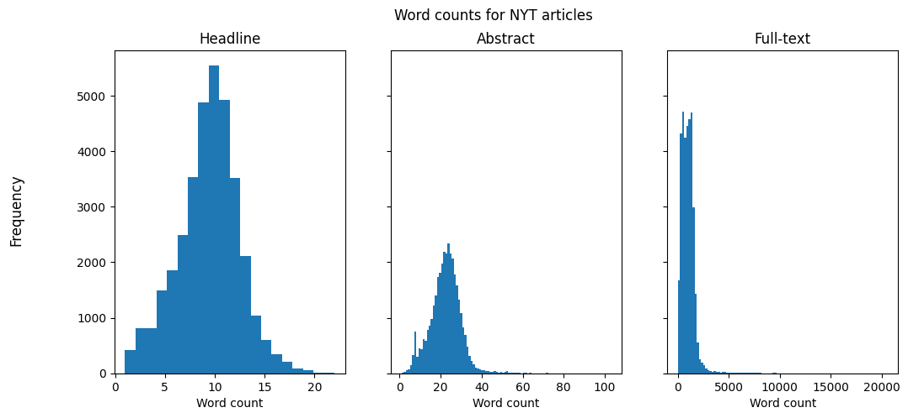
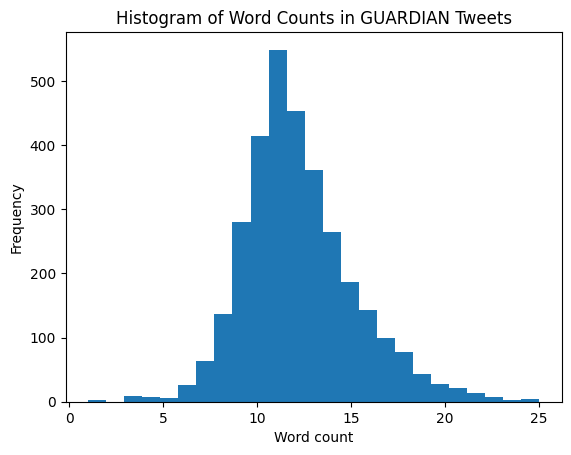

# Collecting and Exploring Datasets

This repo contains code and results of my explorations of text data from different sources. The aim is to create a dataset that consists of related longer and short texts from the same source or plattform.  Longer texts are such as blog posts or news articles (full-text) and short text, should be similar in length to social media posts, such as abstracts or taglines.

**First idea: The New York Times API**  
NYT offers a set of APIs and also have one for their archive. It contains partial articles (e.g. headline, abstract) and other information, such as which section an article belongs to (e.g. Arts, News) and the length of it (word count).  
Unfortunately they only offer unlimited access to the full-texts in the [article archive](https://help.nytimes.com/hc/en-us/articles/115014772767-New-York-Times-Archived-Articles-and-TimesMachine-) for subscribed users. 

Althogh I won't be using their data for my research project, the available data is useful to find out some characteristics of news articles, e.g. the average length or how long their abstracts and titles are. This information could help in finding similar open-access data.

## Repo Structure

```bash
.
├── README.md
├── config.ini
├── data
│   └── raw
│       ├── gu_twitter
│       ├── guardian
│       └── nyt_headlines
├── notebooks
│   ├── 01_nyt_apis.ipynb
│   ├── 02_guardian_api.ipynb
│   ├── 03_twitter_api.ipynb
│   └── 04_explore_datasets.ipynb
├── requirements.in
├── requirements.txt
└── src
    ├── __init__.py
    ├── data
    │   ├── __init__.py
    │   └── clean_text.py
    │   └── make_dataset.py
    └── main.py
```


```python
import os
import glob
import pandas as pd

import matplotlib.pyplot as plt

# Notebook settings
import warnings
warnings.filterwarnings('ignore')
```


```python
# Set data directory paths
nyt_path = 'data/interim/nyt_data'
gu_path = 'data/interim/gu_data'
gu_twitter_path = 'data/interim/gu_twitter_data/gu_tweets.csv'
```


```python
nyt_files = glob.glob(os.path.join(nyt_path, '*.csv'))
nyt_lst = []

for file in nyt_files:
    nyt_single_df = pd.read_csv(file)
    nyt_lst.append(nyt_single_df)

nyt_df = pd.concat(nyt_lst)
```


```python
gu_files = glob.glob(os.path.join(gu_path, '*.csv'))
gu_lst = []

for file in gu_files:
    gu_single_df = pd.read_csv(file)
    gu_lst.append(gu_single_df)

gu_df = pd.concat(gu_lst)
```


```python
twitter_df = pd.read_csv(gu_twitter_path)
```


```python
nyt_df.describe()
```


<div>
<style scoped>
    .dataframe tbody tr th:only-of-type {
        vertical-align: middle;
    }

    .dataframe tbody tr th {
        vertical-align: top;
    }

    .dataframe thead th {
        text-align: right;
    }
</style>
<table border="1" class="dataframe">
  <thead>
    <tr style="text-align: right;">
      <th></th>
      <th>word_count</th>
      <th>word_count_headline</th>
      <th>word_count_abstract</th>
    </tr>
  </thead>
  <tbody>
    <tr>
      <th>count</th>
      <td>34752.000000</td>
      <td>34752.000000</td>
      <td>34752.000000</td>
    </tr>
    <tr>
      <th>mean</th>
      <td>991.256417</td>
      <td>9.483943</td>
      <td>22.524660</td>
    </tr>
    <tr>
      <th>std</th>
      <td>698.379953</td>
      <td>2.946029</td>
      <td>7.412678</td>
    </tr>
    <tr>
      <th>min</th>
      <td>0.000000</td>
      <td>1.000000</td>
      <td>1.000000</td>
    </tr>
    <tr>
      <th>25%</th>
      <td>525.000000</td>
      <td>8.000000</td>
      <td>18.000000</td>
    </tr>
    <tr>
      <th>50%</th>
      <td>934.000000</td>
      <td>10.000000</td>
      <td>23.000000</td>
    </tr>
    <tr>
      <th>75%</th>
      <td>1315.000000</td>
      <td>11.000000</td>
      <td>27.000000</td>
    </tr>
    <tr>
      <th>max</th>
      <td>20573.000000</td>
      <td>22.000000</td>
      <td>103.000000</td>
    </tr>
  </tbody>
</table>
</div>


```python
fig, (ax1, ax2, ax3) = plt.subplots(1, 3, sharey=True, figsize=(12,5))
fig.suptitle('Word counts for NYT articles')
fig.supylabel('Frequency')

ax1.hist(nyt_df['word_count_headline'], bins=20)
ax1.set_title('Headline')
ax2.hist(nyt_df['word_count_abstract'], bins=100)
ax2.set_title('Abstract')
ax3.hist(nyt_df['word_count'], bins=100)
ax3.set_title('Full-text')

for ax in (ax1, ax2, ax3):
    ax.set(xlabel='Word count')

plt.show()
```


    

    


```python
gu_df.describe()
```


<div>
<style scoped>
    .dataframe tbody tr th:only-of-type {
        vertical-align: middle;
    }

    .dataframe tbody tr th {
        vertical-align: top;
    }

    .dataframe thead th {
        text-align: right;
    }
</style>
<table border="1" class="dataframe">
  <thead>
    <tr style="text-align: right;">
      <th></th>
      <th>wordcount</th>
      <th>charCount</th>
      <th>word_count_headline</th>
      <th>word_count_trailText</th>
    </tr>
  </thead>
  <tbody>
    <tr>
      <th>count</th>
      <td>74918.000000</td>
      <td>74918.000000</td>
      <td>74918.000000</td>
      <td>74918.000000</td>
    </tr>
    <tr>
      <th>mean</th>
      <td>779.966110</td>
      <td>4644.092381</td>
      <td>11.642970</td>
      <td>19.905043</td>
    </tr>
    <tr>
      <th>std</th>
      <td>465.097429</td>
      <td>2727.397471</td>
      <td>2.942463</td>
      <td>5.496729</td>
    </tr>
    <tr>
      <th>min</th>
      <td>0.000000</td>
      <td>0.000000</td>
      <td>2.000000</td>
      <td>1.000000</td>
    </tr>
    <tr>
      <th>25%</th>
      <td>498.000000</td>
      <td>2979.000000</td>
      <td>10.000000</td>
      <td>16.000000</td>
    </tr>
    <tr>
      <th>50%</th>
      <td>711.000000</td>
      <td>4239.000000</td>
      <td>12.000000</td>
      <td>19.000000</td>
    </tr>
    <tr>
      <th>75%</th>
      <td>947.000000</td>
      <td>5654.000000</td>
      <td>13.000000</td>
      <td>23.000000</td>
    </tr>
    <tr>
      <th>max</th>
      <td>9633.000000</td>
      <td>54826.000000</td>
      <td>28.000000</td>
      <td>77.000000</td>
    </tr>
  </tbody>
</table>
</div>


```python
fig, (ax1, ax2, ax3) = plt.subplots(1, 3, sharey=True, figsize=(12,5))
fig.suptitle('Word counts for GUARDIAN articles')
fig.supylabel('Frequency')

ax1.hist(gu_df['word_count_headline'], bins=30)
ax1.set_title('Headline')
ax2.hist(gu_df['word_count_trailText'], bins=100)
ax2.set_title('Abstract')
ax3.hist(gu_df['wordcount'], bins=100)
ax3.set_title('Full-text')

for ax in (ax1, ax2, ax3):
    ax.set(xlabel='Word count')

plt.show()
```


    

    


```python
twitter_df.head()
```


<div>
<style scoped>
    .dataframe tbody tr th:only-of-type {
        vertical-align: middle;
    }

    .dataframe tbody tr th {
        vertical-align: top;
    }

    .dataframe thead th {
        text-align: right;
    }
</style>
<table border="1" class="dataframe">
  <thead>
    <tr style="text-align: right;">
      <th></th>
      <th>created_at</th>
      <th>id</th>
      <th>text</th>
      <th>clean_text</th>
      <th>word_count</th>
    </tr>
  </thead>
  <tbody>
    <tr>
      <th>0</th>
      <td>Wed Sep 28 21:17:47 +0000 2022</td>
      <td>1575233331943309339</td>
      <td>Morning mail: hurricane with 240km/h winds hit...</td>
      <td>Morning mail hurricane with kmh winds hits Flo...</td>
      <td>14</td>
    </tr>
    <tr>
      <th>1</th>
      <td>Wed Sep 28 21:17:46 +0000 2022</td>
      <td>1575233327329574924</td>
      <td>R Kelly ordered to pay restitution of $300,000...</td>
      <td>R Kelly ordered to pay restitution of to his v...</td>
      <td>10</td>
    </tr>
    <tr>
      <th>2</th>
      <td>Wed Sep 28 21:17:44 +0000 2022</td>
      <td>1575233321063292928</td>
      <td>Two aircraft involved in ‘minor collision’ on ...</td>
      <td>Two aircraft involved in ‘minor collision’ on ...</td>
      <td>10</td>
    </tr>
    <tr>
      <th>3</th>
      <td>Wed Sep 28 21:10:00 +0000 2022</td>
      <td>1575231372490309658</td>
      <td>We’re keen to hear from people who have recent...</td>
      <td>We’re keen to hear from people who have recent...</td>
      <td>25</td>
    </tr>
    <tr>
      <th>4</th>
      <td>Wed Sep 28 21:03:05 +0000 2022</td>
      <td>1575229631912869894</td>
      <td>Guardian front page, Thursday 29 September 202...</td>
      <td>Guardian front page Thursday September Banks £...</td>
      <td>12</td>
    </tr>
  </tbody>
</table>
</div>


```python
twitter_df.describe()
```


<div>
<style scoped>
    .dataframe tbody tr th:only-of-type {
        vertical-align: middle;
    }

    .dataframe tbody tr th {
        vertical-align: top;
    }

    .dataframe thead th {
        text-align: right;
    }
</style>
<table border="1" class="dataframe">
  <thead>
    <tr style="text-align: right;">
      <th></th>
      <th>id</th>
      <th>word_count</th>
    </tr>
  </thead>
  <tbody>
    <tr>
      <th>count</th>
      <td>3.200000e+03</td>
      <td>3200.000000</td>
    </tr>
    <tr>
      <th>mean</th>
      <td>1.572793e+18</td>
      <td>12.177188</td>
    </tr>
    <tr>
      <th>std</th>
      <td>1.462916e+15</td>
      <td>3.107159</td>
    </tr>
    <tr>
      <th>min</th>
      <td>1.570134e+18</td>
      <td>1.000000</td>
    </tr>
    <tr>
      <th>25%</th>
      <td>1.571554e+18</td>
      <td>10.000000</td>
    </tr>
    <tr>
      <th>50%</th>
      <td>1.572913e+18</td>
      <td>12.000000</td>
    </tr>
    <tr>
      <th>75%</th>
      <td>1.574037e+18</td>
      <td>14.000000</td>
    </tr>
    <tr>
      <th>max</th>
      <td>1.575233e+18</td>
      <td>25.000000</td>
    </tr>
  </tbody>
</table>
</div>


```python
plt.hist(twitter_df['word_count'], bins=25)
plt.xlabel('Word count')
plt.ylabel('Frequency')
plt.title('Histogram of Word Counts in GUARDIAN Tweets')
plt.show()
```


    

    

