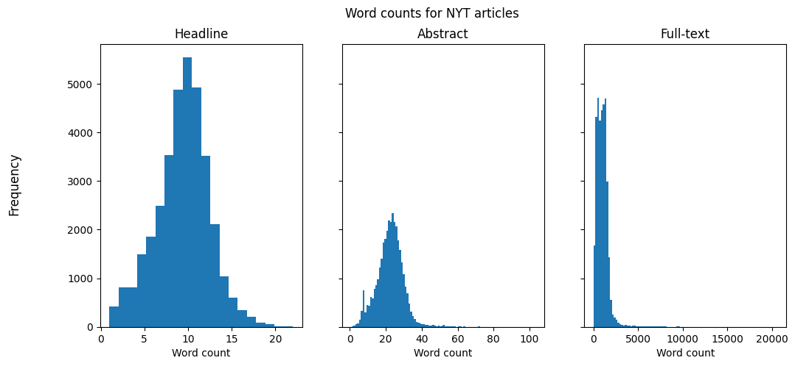
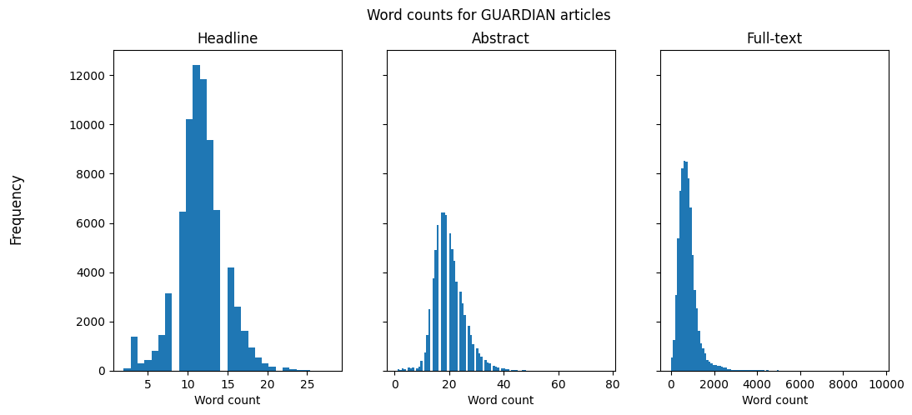
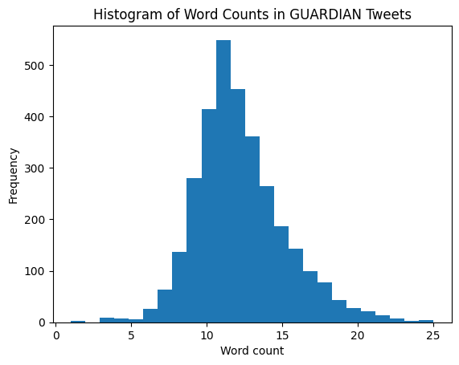
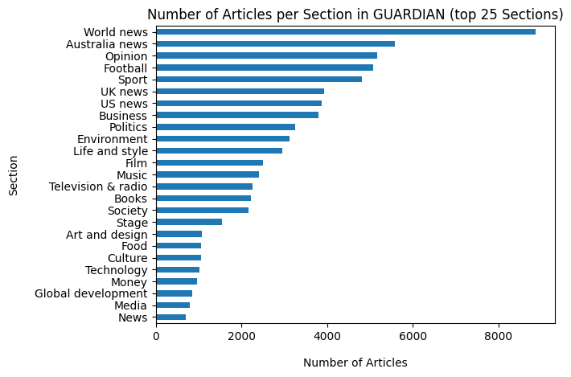

# Collecting and Exploring Datasets

This repo contains code and results of my explorations of text data from different sources. The aim is to create a dataset that consists of related longer and short texts from the same source or plattform.  Longer texts are such as blog posts or news articles (full-text) and short text, should be similar in length to social media posts, such as abstracts or taglines.

**First idea: The New York Times API**  
NYT offers a set of APIs and also have one for their archive. It contains partial articles (e.g. headline, abstract) and other information, such as which section an article belongs to (e.g. Arts, News) and the length of it (word count).  
Unfortunately they only offer unlimited access to the full-texts in the [article archive](https://help.nytimes.com/hc/en-us/articles/115014772767-New-York-Times-Archived-Articles-and-TimesMachine-) for subscribed users. 

Althogh I won't be using their data for my research project, the available data is useful to find out some characteristics of news articles, e.g. the average length or how long their abstracts and titles are. This information could help in finding similar open-access data.

## Repo Structure

```bash
.
├── README.md
├── config.ini
├── data
│   ├── raw
│   └── interim
├── notebooks
│   ├── 01_nyt_apis.ipynb
│   ├── 02_guardian_api.ipynb
│   ├── 03_twitter_api.ipynb
│   └── 04_explore_datasets.ipynb
├── requirements.in
├── requirements.txt
└── src
    ├── __init__.py
    ├── data
    │   ├── __init__.py
    │   ├── clean_text.py
    │   └── make_dataset.py
    └── main.py
```

## Datasets

**NYT Dataset:**  
The dataset contains partial article data from the NYT Archive API from 10/2021 to 09/2022, approx. 34,700 items.

**GU Dataset:**  
The dataset contains article data from the GU Search API from 27/09/2021 to 27/09/2022, approx. 75,000 items.

**GU Tweets Dataset:**  
The dataset contains tweets from The Guardian main account ([@guardian](https://twitter.com/guardian)), with 3,200 items (maximum allowed number of tweets from a user as per Twitter API limitations).


```python
import os
import glob
import numpy as np
import pandas as pd
import re

from itertools import chain

import matplotlib.pyplot as plt
import seaborn as sns

# Notebook settings
import warnings
warnings.filterwarnings('ignore')
```


```python
# Set data directory paths
nyt_path = 'data/interim/nyt_data'
gu_path = 'data/interim/gu_data'
gu_twitter_path = 'data/interim/gu_twitter_data/gu_tweets.csv'
```


```python
# Load NYT data files and combine them
nyt_files = glob.glob(os.path.join(nyt_path, '*.csv'))
nyt_lst = []

for file in nyt_files:
    nyt_single_df = pd.read_csv(file)
    nyt_lst.append(nyt_single_df)

nyt_df = pd.concat(nyt_lst)
```


```python
# Load GU data files and combine them
gu_files = glob.glob(os.path.join(gu_path, '*.csv'))
gu_lst = []

for file in gu_files:
    gu_single_df = pd.read_csv(file)
    gu_lst.append(gu_single_df)

gu_df = pd.concat(gu_lst)
```


```python
# Load GU Twitter data
twitter_df = pd.read_csv(gu_twitter_path)
```

### The New York Times


```python
nyt_df.describe()
```


<div>
<table border="1" class="dataframe">
  <thead>
    <tr style="text-align: right;">
      <th></th>
      <th>word_count</th>
      <th>word_count_headline</th>
      <th>word_count_abstract</th>
    </tr>
  </thead>
  <tbody>
    <tr>
      <th>count</th>
      <td>34752.000000</td>
      <td>34752.000000</td>
      <td>34752.000000</td>
    </tr>
    <tr>
      <th>mean</th>
      <td>991.256417</td>
      <td>9.483943</td>
      <td>22.524660</td>
    </tr>
    <tr>
      <th>std</th>
      <td>698.379953</td>
      <td>2.946029</td>
      <td>7.412678</td>
    </tr>
    <tr>
      <th>min</th>
      <td>0.000000</td>
      <td>1.000000</td>
      <td>1.000000</td>
    </tr>
    <tr>
      <th>25%</th>
      <td>525.000000</td>
      <td>8.000000</td>
      <td>18.000000</td>
    </tr>
    <tr>
      <th>50%</th>
      <td>934.000000</td>
      <td>10.000000</td>
      <td>23.000000</td>
    </tr>
    <tr>
      <th>75%</th>
      <td>1315.000000</td>
      <td>11.000000</td>
      <td>27.000000</td>
    </tr>
    <tr>
      <th>max</th>
      <td>20573.000000</td>
      <td>22.000000</td>
      <td>103.000000</td>
    </tr>
  </tbody>
</table>
</div>


```python
fig, (ax1, ax2, ax3) = plt.subplots(1, 3, sharey=True, figsize=(12,5))
fig.suptitle('Word counts for NYT articles')
fig.supylabel('Frequency')

ax1.hist(nyt_df['word_count_headline'], bins=20)
ax1.set_title('Headline')
ax2.hist(nyt_df['word_count_abstract'], bins=100)
ax2.set_title('Abstract')
ax3.hist(nyt_df['word_count'], bins=100)
ax3.set_title('Full-text')

for ax in (ax1, ax2, ax3):
    ax.set(xlabel='Word count')

plt.show()
```


    

    


### The Guardian


```python
gu_df.describe()
```


<div>
<table border="1" class="dataframe">
  <thead>
    <tr style="text-align: right;">
      <th></th>
      <th>wordcount</th>
      <th>charCount</th>
      <th>word_count_headline</th>
      <th>word_count_trailText</th>
    </tr>
  </thead>
  <tbody>
    <tr>
      <th>count</th>
      <td>74956.000000</td>
      <td>74956.000000</td>
      <td>74956.000000</td>
      <td>74956.000000</td>
    </tr>
    <tr>
      <th>mean</th>
      <td>780.012301</td>
      <td>4644.333662</td>
      <td>11.643658</td>
      <td>19.906385</td>
    </tr>
    <tr>
      <th>std</th>
      <td>464.920930</td>
      <td>2726.342686</td>
      <td>2.943087</td>
      <td>5.498631</td>
    </tr>
    <tr>
      <th>min</th>
      <td>0.000000</td>
      <td>0.000000</td>
      <td>2.000000</td>
      <td>1.000000</td>
    </tr>
    <tr>
      <th>25%</th>
      <td>498.000000</td>
      <td>2980.000000</td>
      <td>10.000000</td>
      <td>16.000000</td>
    </tr>
    <tr>
      <th>50%</th>
      <td>711.000000</td>
      <td>4239.000000</td>
      <td>12.000000</td>
      <td>19.000000</td>
    </tr>
    <tr>
      <th>75%</th>
      <td>947.000000</td>
      <td>5654.000000</td>
      <td>13.000000</td>
      <td>23.000000</td>
    </tr>
    <tr>
      <th>max</th>
      <td>9633.000000</td>
      <td>54826.000000</td>
      <td>28.000000</td>
      <td>77.000000</td>
    </tr>
  </tbody>
</table>
</div>


```python
fig, (ax1, ax2, ax3) = plt.subplots(1, 3, sharey=True, figsize=(12,5))
fig.suptitle('Word counts for GUARDIAN articles')
fig.supylabel('Frequency')

ax1.hist(gu_df['word_count_headline'], bins=30)
ax1.set_title('Headline')
ax2.hist(gu_df['word_count_trailText'], bins=100)
ax2.set_title('Abstract')
ax3.hist(gu_df['wordcount'], bins=100)
ax3.set_title('Full-text')

for ax in (ax1, ax2, ax3):
    ax.set(xlabel='Word count')

plt.show()
```


    

    


### Tweets from The Guardian


```python
twitter_df.head()
```


<div>
<table border="1" class="dataframe">
  <thead>
    <tr style="text-align: right;">
      <th></th>
      <th>created_at</th>
      <th>id</th>
      <th>text</th>
      <th>clean_text</th>
      <th>word_count</th>
    </tr>
  </thead>
  <tbody>
    <tr>
      <th>0</th>
      <td>Wed Sep 28 21:17:47 +0000 2022</td>
      <td>1575233331943309339</td>
      <td>Morning mail: hurricane with 240km/h winds hit...</td>
      <td>Morning mail hurricane with kmh winds hits Flo...</td>
      <td>14</td>
    </tr>
    <tr>
      <th>1</th>
      <td>Wed Sep 28 21:17:46 +0000 2022</td>
      <td>1575233327329574924</td>
      <td>R Kelly ordered to pay restitution of $300,000...</td>
      <td>R Kelly ordered to pay restitution of to his v...</td>
      <td>10</td>
    </tr>
    <tr>
      <th>2</th>
      <td>Wed Sep 28 21:17:44 +0000 2022</td>
      <td>1575233321063292928</td>
      <td>Two aircraft involved in ‘minor collision’ on ...</td>
      <td>Two aircraft involved in ‘minor collision’ on ...</td>
      <td>10</td>
    </tr>
    <tr>
      <th>3</th>
      <td>Wed Sep 28 21:10:00 +0000 2022</td>
      <td>1575231372490309658</td>
      <td>We’re keen to hear from people who have recent...</td>
      <td>We’re keen to hear from people who have recent...</td>
      <td>25</td>
    </tr>
    <tr>
      <th>4</th>
      <td>Wed Sep 28 21:03:05 +0000 2022</td>
      <td>1575229631912869894</td>
      <td>Guardian front page, Thursday 29 September 202...</td>
      <td>Guardian front page Thursday September Banks £...</td>
      <td>12</td>
    </tr>
  </tbody>
</table>
</div>


```python
twitter_df.describe()
```


<div>
<table border="1" class="dataframe">
  <thead>
    <tr style="text-align: right;">
      <th></th>
      <th>id</th>
      <th>word_count</th>
    </tr>
  </thead>
  <tbody>
    <tr>
      <th>count</th>
      <td>3.200000e+03</td>
      <td>3200.000000</td>
    </tr>
    <tr>
      <th>mean</th>
      <td>1.572793e+18</td>
      <td>12.177188</td>
    </tr>
    <tr>
      <th>std</th>
      <td>1.462916e+15</td>
      <td>3.107159</td>
    </tr>
    <tr>
      <th>min</th>
      <td>1.570134e+18</td>
      <td>1.000000</td>
    </tr>
    <tr>
      <th>25%</th>
      <td>1.571554e+18</td>
      <td>10.000000</td>
    </tr>
    <tr>
      <th>50%</th>
      <td>1.572913e+18</td>
      <td>12.000000</td>
    </tr>
    <tr>
      <th>75%</th>
      <td>1.574037e+18</td>
      <td>14.000000</td>
    </tr>
    <tr>
      <th>max</th>
      <td>1.575233e+18</td>
      <td>25.000000</td>
    </tr>
  </tbody>
</table>
</div>


```python
plt.hist(twitter_df['word_count'], bins=25)
plt.xlabel('Word count')
plt.ylabel('Frequency')
plt.title('Histogram of Word Counts in GUARDIAN Tweets')
plt.show()
```


    

    


---

# The Guardian Dataset Features


```python
gu_df.head()
```


<div>
<table border="1" class="dataframe">
  <thead>
    <tr style="text-align: right;">
      <th></th>
      <th>id</th>
      <th>sectionId</th>
      <th>sectionName</th>
      <th>webPublicationDate</th>
      <th>webUrl</th>
      <th>apiUrl</th>
      <th>pillarId</th>
      <th>pillarName</th>
      <th>byline</th>
      <th>body</th>
      <th>...</th>
      <th>bylineHtml</th>
      <th>fields.contributorBio</th>
      <th>scheduledPublicationDate</th>
      <th>tag_ids</th>
      <th>tag_webTitles</th>
      <th>tag_webUrls</th>
      <th>cl_headline</th>
      <th>cl_trailText</th>
      <th>word_count_headline</th>
      <th>word_count_trailText</th>
    </tr>
  </thead>
  <tbody>
    <tr>
      <th>0</th>
      <td>sport/blog/2022/jun/27/imperious-nsw-seize-adv...</td>
      <td>sport</td>
      <td>Sport</td>
      <td>2022-06-26T23:46:44Z</td>
      <td>https://www.theguardian.com/sport/blog/2022/ju...</td>
      <td>https://content.guardianapis.com/sport/blog/20...</td>
      <td>pillar/sport</td>
      <td>Sport</td>
      <td>Nick Tedeschi</td>
      <td>&lt;p&gt;A star was born in debutant Matt Burton. An...</td>
      <td>...</td>
      <td>&lt;a href="profile/nick-tedeschi"&gt;Nick Tedeschi&lt;/a&gt;</td>
      <td>NaN</td>
      <td>NaN</td>
      <td>['sport/state-of-origin', 'sport/rugbyleague',...</td>
      <td>['State of Origin', 'Rugby league', 'NRL', 'Au...</td>
      <td>['https://www.theguardian.com/sport/state-of-o...</td>
      <td>Imperious NSW seize advantage after Queensland...</td>
      <td>Poor tackling basic handling errors and a lack...</td>
      <td>10</td>
      <td>23</td>
    </tr>
    <tr>
      <th>1</th>
      <td>music/2022/jun/27/kendrick-lamar-at-glastonbur...</td>
      <td>music</td>
      <td>Music</td>
      <td>2022-06-26T23:32:10Z</td>
      <td>https://www.theguardian.com/music/2022/jun/27/...</td>
      <td>https://content.guardianapis.com/music/2022/ju...</td>
      <td>pillar/arts</td>
      <td>Arts</td>
      <td>Alexis Petridis</td>
      <td>&lt;p&gt;As Glastonbury 2022 draws to a close, a var...</td>
      <td>...</td>
      <td>&lt;a href="profile/alexispetridis"&gt;Alexis Petrid...</td>
      <td>NaN</td>
      <td>NaN</td>
      <td>['music/glastonbury-2022', 'music/kendrick-lam...</td>
      <td>['Glastonbury 2022', 'Kendrick Lamar', 'Music'...</td>
      <td>['https://www.theguardian.com/music/glastonbur...</td>
      <td>Kendrick Lamar at Glastonbury review – faith f...</td>
      <td>Sporting a bejewelled crown of thorns and with...</td>
      <td>11</td>
      <td>25</td>
    </tr>
    <tr>
      <th>2</th>
      <td>world/2022/jun/27/garbage-island-no-more-how-o...</td>
      <td>world</td>
      <td>World news</td>
      <td>2022-06-26T23:06:58Z</td>
      <td>https://www.theguardian.com/world/2022/jun/27/...</td>
      <td>https://content.guardianapis.com/world/2022/ju...</td>
      <td>pillar/news</td>
      <td>News</td>
      <td>Justin McCurry on Teshima island</td>
      <td>&lt;p&gt;Toru Ishii remembers when the shredded car ...</td>
      <td>...</td>
      <td>&lt;a href="profile/justinmccurry"&gt;Justin McCurry...</td>
      <td>NaN</td>
      <td>NaN</td>
      <td>['world/japan', 'world/asia-pacific', 'world/w...</td>
      <td>['Japan', 'Asia Pacific', 'World news', 'Envir...</td>
      <td>['https://www.theguardian.com/world/japan', 'h...</td>
      <td>Garbage island no more how one Japanese commun...</td>
      <td>Teshima – site of Japan’s worst case of illega...</td>
      <td>14</td>
      <td>27</td>
    </tr>
    <tr>
      <th>3</th>
      <td>media/2022/jun/27/young-people-must-report-har...</td>
      <td>media</td>
      <td>Media</td>
      <td>2022-06-26T23:01:00Z</td>
      <td>https://www.theguardian.com/media/2022/jun/27/...</td>
      <td>https://content.guardianapis.com/media/2022/ju...</td>
      <td>pillar/news</td>
      <td>News</td>
      <td>Dan Milmo</td>
      <td>&lt;p&gt;Young people should report harmful online c...</td>
      <td>...</td>
      <td>&lt;a href="profile/danmilmo"&gt;Dan Milmo&lt;/a&gt;</td>
      <td>NaN</td>
      <td>NaN</td>
      <td>['media/ofcom', 'media/social-media', 'society...</td>
      <td>['Ofcom', 'Social media', 'Online abuse', 'You...</td>
      <td>['https://www.theguardian.com/media/ofcom', 'h...</td>
      <td>Young people must report harmful online conten...</td>
      <td>Ofcom says of to yearolds have seen harmful co...</td>
      <td>10</td>
      <td>16</td>
    </tr>
    <tr>
      <th>4</th>
      <td>stage/2022/jun/27/mad-house-review-david-harbo...</td>
      <td>stage</td>
      <td>Stage</td>
      <td>2022-06-26T23:01:00Z</td>
      <td>https://www.theguardian.com/stage/2022/jun/27/...</td>
      <td>https://content.guardianapis.com/stage/2022/ju...</td>
      <td>pillar/arts</td>
      <td>Arts</td>
      <td>Arifa Akbar</td>
      <td>&lt;p&gt;Theresa Rebeck’s play opens as a dysfunctio...</td>
      <td>...</td>
      <td>&lt;a href="profile/arifa-akbar"&gt;Arifa Akbar&lt;/a&gt;</td>
      <td>NaN</td>
      <td>NaN</td>
      <td>['stage/theatre', 'stage/stage', 'culture/cult...</td>
      <td>['Theatre', 'Stage', 'Culture', 'Article', 'Re...</td>
      <td>['https://www.theguardian.com/stage/theatre', ...</td>
      <td>Mad House review – David Harbour and Bill Pull...</td>
      <td>Theresa Rebeck’s play follows the relationship...</td>
      <td>14</td>
      <td>16</td>
    </tr>
  </tbody>
</table>
<p>5 rows × 25 columns</p>
</div>


```python
gu_df.info()
```

    <class 'pandas.core.frame.DataFrame'>
    Int64Index: 74956 entries, 0 to 6145
    Data columns (total 25 columns):
     #   Column                    Non-Null Count  Dtype 
    ---  ------                    --------------  ----- 
     0   id                        74956 non-null  object
     1   sectionId                 74956 non-null  object
     2   sectionName               74956 non-null  object
     3   webPublicationDate        74956 non-null  object
     4   webUrl                    74956 non-null  object
     5   apiUrl                    74956 non-null  object
     6   pillarId                  74453 non-null  object
     7   pillarName                74453 non-null  object
     8   byline                    73447 non-null  object
     9   body                      74956 non-null  object
     10  wordcount                 74956 non-null  int64 
     11  publication               74956 non-null  object
     12  lang                      74956 non-null  object
     13  bodyText                  74757 non-null  object
     14  charCount                 74956 non-null  int64 
     15  bylineHtml                73447 non-null  object
     16  fields.contributorBio     15 non-null     object
     17  scheduledPublicationDate  3 non-null      object
     18  tag_ids                   74956 non-null  object
     19  tag_webTitles             74956 non-null  object
     20  tag_webUrls               74956 non-null  object
     21  cl_headline               74956 non-null  object
     22  cl_trailText              74904 non-null  object
     23  word_count_headline       74956 non-null  int64 
     24  word_count_trailText      74956 non-null  int64 
    dtypes: int64(4), object(21)
    memory usage: 14.9+ MB


The NYT has more longer articles than the GU. The headlines show the opposite behaviour. The abstracts seem similar in both.  
Compared to the length of tweets, the most similar article part in length is the headline.


```python
# Check for duplicates
gu_df[gu_df.duplicated(['id','webUrl'], keep=False)]
```


<div>
<table border="1" class="dataframe">
  <thead>
    <tr style="text-align: right;">
      <th></th>
      <th>id</th>
      <th>sectionId</th>
      <th>sectionName</th>
      <th>webPublicationDate</th>
      <th>webUrl</th>
      <th>apiUrl</th>
      <th>pillarId</th>
      <th>pillarName</th>
      <th>byline</th>
      <th>body</th>
      <th>...</th>
      <th>bylineHtml</th>
      <th>fields.contributorBio</th>
      <th>scheduledPublicationDate</th>
      <th>tag_ids</th>
      <th>tag_webTitles</th>
      <th>tag_webUrls</th>
      <th>cl_headline</th>
      <th>cl_trailText</th>
      <th>word_count_headline</th>
      <th>word_count_trailText</th>
    </tr>
  </thead>
  <tbody>
    <tr>
      <th>4912</th>
      <td>lifeandstyle/2022/sep/05/work-therapy-can-a-so...</td>
      <td>lifeandstyle</td>
      <td>Life and style</td>
      <td>2022-09-04T17:30:03Z</td>
      <td>https://www.theguardian.com/lifeandstyle/2022/...</td>
      <td>https://content.guardianapis.com/lifeandstyle/...</td>
      <td>pillar/lifestyle</td>
      <td>Lifestyle</td>
      <td>Jenny Valentish</td>
      <td>&lt;p&gt;Whether you’re a quiet quitter or a 24/7 si...</td>
      <td>...</td>
      <td>&lt;a href="profile/jenny-valentish"&gt;Jenny Valent...</td>
      <td>NaN</td>
      <td>NaN</td>
      <td>['lifeandstyle/australian-lifestyle', 'music/a...</td>
      <td>[Australian lifestyle, Australian music, Artic...</td>
      <td>['https://www.theguardian.com/lifeandstyle/aus...</td>
      <td>Work therapy can a social media coach talk a s...</td>
      <td>Musician Dave McCormack hates social media but...</td>
      <td>15</td>
      <td>27</td>
    </tr>
    <tr>
      <th>4913</th>
      <td>lifeandstyle/2022/sep/05/work-therapy-can-a-so...</td>
      <td>lifeandstyle</td>
      <td>Life and style</td>
      <td>2022-09-04T17:30:03Z</td>
      <td>https://www.theguardian.com/lifeandstyle/2022/...</td>
      <td>https://content.guardianapis.com/lifeandstyle/...</td>
      <td>pillar/lifestyle</td>
      <td>Lifestyle</td>
      <td>Jenny Valentish</td>
      <td>&lt;p&gt;Whether you’re a quiet quitter or a 24/7 si...</td>
      <td>...</td>
      <td>&lt;a href="profile/jenny-valentish"&gt;Jenny Valent...</td>
      <td>NaN</td>
      <td>NaN</td>
      <td>['lifeandstyle/australian-lifestyle', 'music/a...</td>
      <td>[Australian lifestyle, Australian music, Artic...</td>
      <td>['https://www.theguardian.com/lifeandstyle/aus...</td>
      <td>Work therapy can a social media coach talk a s...</td>
      <td>Musician Dave McCormack hates social media but...</td>
      <td>15</td>
      <td>27</td>
    </tr>
    <tr>
      <th>1247</th>
      <td>film/2022/aug/21/anais-in-love-review-anais-de...</td>
      <td>film</td>
      <td>Film</td>
      <td>2022-08-21T07:00:02Z</td>
      <td>https://www.theguardian.com/film/2022/aug/21/a...</td>
      <td>https://content.guardianapis.com/film/2022/aug...</td>
      <td>pillar/arts</td>
      <td>Arts</td>
      <td>Wendy Ide</td>
      <td>&lt;p&gt;She’s a familiar character. Skittish, self-...</td>
      <td>...</td>
      <td>&lt;a href="profile/wendy-ide"&gt;Wendy Ide&lt;/a&gt;</td>
      <td>NaN</td>
      <td>NaN</td>
      <td>['film/drama', 'film/film', 'culture/culture',...</td>
      <td>[Drama films, Film, Culture, World cinema, Art...</td>
      <td>['https://www.theguardian.com/film/drama', 'ht...</td>
      <td>Anaïs in Love review – Anaïs Demoustier intoxi...</td>
      <td>Cinema’s latest irresistible chaotic femme Dem...</td>
      <td>13</td>
      <td>16</td>
    </tr>
    <tr>
      <th>1248</th>
      <td>lifeandstyle/2022/aug/21/emma-beddington-my-ki...</td>
      <td>lifeandstyle</td>
      <td>Life and style</td>
      <td>2022-08-21T07:00:02Z</td>
      <td>https://www.theguardian.com/lifeandstyle/2022/...</td>
      <td>https://content.guardianapis.com/lifeandstyle/...</td>
      <td>pillar/lifestyle</td>
      <td>Lifestyle</td>
      <td>Emma Beddington</td>
      <td>&lt;p&gt;I’m nearly an empty nester. That conjures u...</td>
      <td>...</td>
      <td>&lt;a href="profile/emma-beddington"&gt;Emma Bedding...</td>
      <td>NaN</td>
      <td>NaN</td>
      <td>['lifeandstyle/parents-and-parenting', 'lifean...</td>
      <td>[Parents and parenting, Family, Life and style...</td>
      <td>['https://www.theguardian.com/lifeandstyle/par...</td>
      <td>My kids have moved out but please don’t call i...</td>
      <td>I want to take issue with this nests metaphor ...</td>
      <td>13</td>
      <td>19</td>
    </tr>
    <tr>
      <th>1249</th>
      <td>film/2022/aug/21/anais-in-love-review-anais-de...</td>
      <td>film</td>
      <td>Film</td>
      <td>2022-08-21T07:00:02Z</td>
      <td>https://www.theguardian.com/film/2022/aug/21/a...</td>
      <td>https://content.guardianapis.com/film/2022/aug...</td>
      <td>pillar/arts</td>
      <td>Arts</td>
      <td>Wendy Ide</td>
      <td>&lt;p&gt;She’s a familiar character. Skittish, self-...</td>
      <td>...</td>
      <td>&lt;a href="profile/wendy-ide"&gt;Wendy Ide&lt;/a&gt;</td>
      <td>NaN</td>
      <td>NaN</td>
      <td>['film/drama', 'film/film', 'culture/culture',...</td>
      <td>[Drama films, Film, Culture, World cinema, Art...</td>
      <td>['https://www.theguardian.com/film/drama', 'ht...</td>
      <td>Anaïs in Love review – Anaïs Demoustier intoxi...</td>
      <td>Cinema’s latest irresistible chaotic femme Dem...</td>
      <td>13</td>
      <td>16</td>
    </tr>
    <tr>
      <th>1250</th>
      <td>lifeandstyle/2022/aug/21/emma-beddington-my-ki...</td>
      <td>lifeandstyle</td>
      <td>Life and style</td>
      <td>2022-08-21T07:00:02Z</td>
      <td>https://www.theguardian.com/lifeandstyle/2022/...</td>
      <td>https://content.guardianapis.com/lifeandstyle/...</td>
      <td>pillar/lifestyle</td>
      <td>Lifestyle</td>
      <td>Emma Beddington</td>
      <td>&lt;p&gt;I’m nearly an empty nester. That conjures u...</td>
      <td>...</td>
      <td>&lt;a href="profile/emma-beddington"&gt;Emma Bedding...</td>
      <td>NaN</td>
      <td>NaN</td>
      <td>['lifeandstyle/parents-and-parenting', 'lifean...</td>
      <td>[Parents and parenting, Family, Life and style...</td>
      <td>['https://www.theguardian.com/lifeandstyle/par...</td>
      <td>My kids have moved out but please don’t call i...</td>
      <td>I want to take issue with this nests metaphor ...</td>
      <td>13</td>
      <td>19</td>
    </tr>
    <tr>
      <th>1390</th>
      <td>world/2022/aug/20/estonia-europe-inflation-hot...</td>
      <td>world</td>
      <td>World news</td>
      <td>2022-08-20T07:00:33Z</td>
      <td>https://www.theguardian.com/world/2022/aug/20/...</td>
      <td>https://content.guardianapis.com/world/2022/au...</td>
      <td>pillar/news</td>
      <td>News</td>
      <td>Daniel Boffey in Tallinn</td>
      <td>&lt;p&gt;Like his cappuccinos, Taniel Vaaderpass, 33...</td>
      <td>...</td>
      <td>&lt;a href="profile/daniel-boffey"&gt;Daniel Boffey&lt;...</td>
      <td>NaN</td>
      <td>NaN</td>
      <td>['world/estonia', 'business/inflation', 'busin...</td>
      <td>[Estonia, Inflation, Eurozone, Business, Econo...</td>
      <td>['https://www.theguardian.com/world/estonia', ...</td>
      <td>‘I am not blaming anyone’ Estonians shrug off ...</td>
      <td>Those in Europe’s inflation hotspot remain cal...</td>
      <td>9</td>
      <td>23</td>
    </tr>
    <tr>
      <th>1392</th>
      <td>world/2022/aug/20/estonia-europe-inflation-hot...</td>
      <td>world</td>
      <td>World news</td>
      <td>2022-08-20T07:00:33Z</td>
      <td>https://www.theguardian.com/world/2022/aug/20/...</td>
      <td>https://content.guardianapis.com/world/2022/au...</td>
      <td>pillar/news</td>
      <td>News</td>
      <td>Daniel Boffey in Tallinn</td>
      <td>&lt;p&gt;Like his cappuccinos, Taniel Vaaderpass, 33...</td>
      <td>...</td>
      <td>&lt;a href="profile/daniel-boffey"&gt;Daniel Boffey&lt;...</td>
      <td>NaN</td>
      <td>NaN</td>
      <td>['world/estonia', 'business/inflation', 'busin...</td>
      <td>[Estonia, Inflation, Eurozone, Business, Econo...</td>
      <td>['https://www.theguardian.com/world/estonia', ...</td>
      <td>‘I am not blaming anyone’ Estonians shrug off ...</td>
      <td>Those in Europe’s inflation hotspot remain cal...</td>
      <td>9</td>
      <td>23</td>
    </tr>
    <tr>
      <th>2580</th>
      <td>politics/2022/may/15/labour-keir-starmer-tory-...</td>
      <td>politics</td>
      <td>Politics</td>
      <td>2022-05-15T16:00:34Z</td>
      <td>https://www.theguardian.com/politics/2022/may/...</td>
      <td>https://content.guardianapis.com/politics/2022...</td>
      <td>pillar/news</td>
      <td>News</td>
      <td>Jessica Elgot Chief political correspondent</td>
      <td>&lt;p&gt;Labour activists in Durham have called on a...</td>
      <td>...</td>
      <td>&lt;a href="profile/jessica-elgot"&gt;Jessica Elgot&lt;...</td>
      <td>NaN</td>
      <td>NaN</td>
      <td>['politics/labour', 'politics/conservatives', ...</td>
      <td>[Labour, Conservatives, Keir Starmer, Politics...</td>
      <td>['https://www.theguardian.com/politics/labour'...</td>
      <td>Labour activists call on Tory MP to withdraw B...</td>
      <td>Local chair accuses Richard Holden of ‘wasting...</td>
      <td>10</td>
      <td>18</td>
    </tr>
    <tr>
      <th>2582</th>
      <td>politics/2022/may/15/labour-keir-starmer-tory-...</td>
      <td>politics</td>
      <td>Politics</td>
      <td>2022-05-15T16:00:34Z</td>
      <td>https://www.theguardian.com/politics/2022/may/...</td>
      <td>https://content.guardianapis.com/politics/2022...</td>
      <td>pillar/news</td>
      <td>News</td>
      <td>Jessica Elgot Chief political correspondent</td>
      <td>&lt;p&gt;Labour activists in Durham have called on a...</td>
      <td>...</td>
      <td>&lt;a href="profile/jessica-elgot"&gt;Jessica Elgot&lt;...</td>
      <td>NaN</td>
      <td>NaN</td>
      <td>['politics/labour', 'politics/conservatives', ...</td>
      <td>[Labour, Conservatives, Keir Starmer, Politics...</td>
      <td>['https://www.theguardian.com/politics/labour'...</td>
      <td>Labour activists call on Tory MP to withdraw B...</td>
      <td>Local chair accuses Richard Holden of ‘wasting...</td>
      <td>10</td>
      <td>18</td>
    </tr>
  </tbody>
</table>
<p>10 rows × 25 columns</p>
</div>


```python
# Drop duplicates
gu_df.drop_duplicates(['id', 'webUrl'], keep='first', inplace=True, ignore_index=True)
```

## Articles per Category/Section in The Guardian

Number of articles per section


```python
gu_df['sectionName'].value_counts().nlargest(25).sort_values(ascending=True).plot(kind='barh')
plt.xlabel("Number of Articles", labelpad=14)
plt.ylabel("Section", labelpad=14)
plt.title("Number of Articles per Section in GUARDIAN (top 25 Sections)")
plt.show()
```


    

    


```python
#gu_df.groupby('sectionName').size().sort_values(ascending=False)
with pd.option_context('display.max_rows', None):
    display(gu_df.groupby('sectionName').agg({'wordcount': [min, max, np.mean, np.median], 'sectionName': 'count'}) \
        .sort_values([('sectionName', 'count')], ascending=False))
```


<div>
<table border="1" class="dataframe">
  <thead>
    <tr>
      <th></th>
      <th colspan="4" halign="left">wordcount</th>
      <th>sectionName</th>
    </tr>
    <tr>
      <th></th>
      <th>min</th>
      <th>max</th>
      <th>mean</th>
      <th>median</th>
      <th>count</th>
    </tr>
    <tr>
      <th>sectionName</th>
      <th></th>
      <th></th>
      <th></th>
      <th></th>
      <th></th>
    </tr>
  </thead>
  <tbody>
    <tr>
      <th>World news</th>
      <td>44</td>
      <td>6734</td>
      <td>794.656148</td>
      <td>706.0</td>
      <td>8873</td>
    </tr>
    <tr>
      <th>Australia news</th>
      <td>0</td>
      <td>3674</td>
      <td>839.524584</td>
      <td>781.0</td>
      <td>5593</td>
    </tr>
    <tr>
      <th>Opinion</th>
      <td>0</td>
      <td>3652</td>
      <td>859.196750</td>
      <td>892.0</td>
      <td>5169</td>
    </tr>
    <tr>
      <th>Football</th>
      <td>0</td>
      <td>6284</td>
      <td>747.456158</td>
      <td>752.0</td>
      <td>5075</td>
    </tr>
    <tr>
      <th>Sport</th>
      <td>0</td>
      <td>6247</td>
      <td>786.508210</td>
      <td>763.0</td>
      <td>4811</td>
    </tr>
    <tr>
      <th>UK news</th>
      <td>41</td>
      <td>7842</td>
      <td>650.519959</td>
      <td>587.0</td>
      <td>3933</td>
    </tr>
    <tr>
      <th>US news</th>
      <td>0</td>
      <td>5215</td>
      <td>862.981171</td>
      <td>785.0</td>
      <td>3877</td>
    </tr>
    <tr>
      <th>Business</th>
      <td>0</td>
      <td>6361</td>
      <td>663.485000</td>
      <td>614.0</td>
      <td>3800</td>
    </tr>
    <tr>
      <th>Politics</th>
      <td>0</td>
      <td>5816</td>
      <td>722.032179</td>
      <td>657.0</td>
      <td>3263</td>
    </tr>
    <tr>
      <th>Environment</th>
      <td>0</td>
      <td>6990</td>
      <td>762.019539</td>
      <td>682.0</td>
      <td>3122</td>
    </tr>
    <tr>
      <th>Life and style</th>
      <td>0</td>
      <td>8000</td>
      <td>782.904100</td>
      <td>699.0</td>
      <td>2951</td>
    </tr>
    <tr>
      <th>Film</th>
      <td>76</td>
      <td>3949</td>
      <td>730.911191</td>
      <td>598.0</td>
      <td>2511</td>
    </tr>
    <tr>
      <th>Music</th>
      <td>50</td>
      <td>5751</td>
      <td>771.810295</td>
      <td>590.0</td>
      <td>2409</td>
    </tr>
    <tr>
      <th>Television &amp; radio</th>
      <td>0</td>
      <td>5612</td>
      <td>879.591774</td>
      <td>766.0</td>
      <td>2261</td>
    </tr>
    <tr>
      <th>Books</th>
      <td>0</td>
      <td>6401</td>
      <td>890.570594</td>
      <td>814.5</td>
      <td>2224</td>
    </tr>
    <tr>
      <th>Society</th>
      <td>51</td>
      <td>6620</td>
      <td>758.870447</td>
      <td>635.0</td>
      <td>2169</td>
    </tr>
    <tr>
      <th>Stage</th>
      <td>38</td>
      <td>4131</td>
      <td>666.072258</td>
      <td>513.0</td>
      <td>1550</td>
    </tr>
    <tr>
      <th>Art and design</th>
      <td>80</td>
      <td>4959</td>
      <td>914.185529</td>
      <td>834.0</td>
      <td>1078</td>
    </tr>
    <tr>
      <th>Food</th>
      <td>1</td>
      <td>9633</td>
      <td>823.816365</td>
      <td>643.0</td>
      <td>1051</td>
    </tr>
    <tr>
      <th>Culture</th>
      <td>0</td>
      <td>5711</td>
      <td>894.080000</td>
      <td>753.5</td>
      <td>1050</td>
    </tr>
    <tr>
      <th>Technology</th>
      <td>79</td>
      <td>4100</td>
      <td>753.202369</td>
      <td>634.0</td>
      <td>1013</td>
    </tr>
    <tr>
      <th>Money</th>
      <td>107</td>
      <td>4231</td>
      <td>714.265979</td>
      <td>571.0</td>
      <td>970</td>
    </tr>
    <tr>
      <th>Global development</th>
      <td>117</td>
      <td>6062</td>
      <td>884.699408</td>
      <td>811.0</td>
      <td>845</td>
    </tr>
    <tr>
      <th>Media</th>
      <td>60</td>
      <td>6037</td>
      <td>711.642857</td>
      <td>582.0</td>
      <td>798</td>
    </tr>
    <tr>
      <th>News</th>
      <td>61</td>
      <td>7824</td>
      <td>503.050360</td>
      <td>227.0</td>
      <td>695</td>
    </tr>
    <tr>
      <th>Education</th>
      <td>67</td>
      <td>5699</td>
      <td>648.908148</td>
      <td>569.0</td>
      <td>675</td>
    </tr>
    <tr>
      <th>Science</th>
      <td>38</td>
      <td>6769</td>
      <td>702.636228</td>
      <td>584.5</td>
      <td>668</td>
    </tr>
    <tr>
      <th>Travel</th>
      <td>0</td>
      <td>5362</td>
      <td>1068.965839</td>
      <td>1079.5</td>
      <td>644</td>
    </tr>
    <tr>
      <th>Fashion</th>
      <td>68</td>
      <td>6798</td>
      <td>666.250554</td>
      <td>544.0</td>
      <td>451</td>
    </tr>
    <tr>
      <th>Law</th>
      <td>94</td>
      <td>2719</td>
      <td>730.716846</td>
      <td>650.0</td>
      <td>279</td>
    </tr>
    <tr>
      <th>Games</th>
      <td>167</td>
      <td>3354</td>
      <td>912.715953</td>
      <td>822.0</td>
      <td>257</td>
    </tr>
    <tr>
      <th>Crosswords</th>
      <td>0</td>
      <td>1164</td>
      <td>318.409574</td>
      <td>153.0</td>
      <td>188</td>
    </tr>
    <tr>
      <th>From the Observer</th>
      <td>269</td>
      <td>1605</td>
      <td>682.702703</td>
      <td>387.0</td>
      <td>111</td>
    </tr>
    <tr>
      <th>Guardian Masterclasses</th>
      <td>30</td>
      <td>1654</td>
      <td>717.337209</td>
      <td>685.5</td>
      <td>86</td>
    </tr>
    <tr>
      <th>Global</th>
      <td>0</td>
      <td>2710</td>
      <td>816.560976</td>
      <td>657.0</td>
      <td>41</td>
    </tr>
    <tr>
      <th>GNM press office</th>
      <td>146</td>
      <td>1118</td>
      <td>512.696970</td>
      <td>476.0</td>
      <td>33</td>
    </tr>
    <tr>
      <th>Inequality</th>
      <td>152</td>
      <td>2000</td>
      <td>671.269231</td>
      <td>614.0</td>
      <td>26</td>
    </tr>
    <tr>
      <th>Info</th>
      <td>179</td>
      <td>7066</td>
      <td>1649.850000</td>
      <td>1060.0</td>
      <td>20</td>
    </tr>
    <tr>
      <th>The invested generation</th>
      <td>763</td>
      <td>1376</td>
      <td>983.937500</td>
      <td>933.5</td>
      <td>16</td>
    </tr>
    <tr>
      <th>Cities</th>
      <td>140</td>
      <td>1094</td>
      <td>656.307692</td>
      <td>669.0</td>
      <td>13</td>
    </tr>
    <tr>
      <th>Animals farmed</th>
      <td>882</td>
      <td>1112</td>
      <td>995.272727</td>
      <td>989.0</td>
      <td>11</td>
    </tr>
    <tr>
      <th>Seek: The new world of work</th>
      <td>640</td>
      <td>1226</td>
      <td>947.100000</td>
      <td>928.0</td>
      <td>10</td>
    </tr>
    <tr>
      <th>Bonjour Provence and Côte d’Azur</th>
      <td>34</td>
      <td>1333</td>
      <td>1008.111111</td>
      <td>1065.0</td>
      <td>9</td>
    </tr>
    <tr>
      <th>Community of solvers</th>
      <td>741</td>
      <td>1271</td>
      <td>976.888889</td>
      <td>882.0</td>
      <td>9</td>
    </tr>
    <tr>
      <th>Membership</th>
      <td>464</td>
      <td>2561</td>
      <td>1171.500000</td>
      <td>1069.0</td>
      <td>8</td>
    </tr>
    <tr>
      <th>Spotify: Morning moods</th>
      <td>576</td>
      <td>1364</td>
      <td>932.375000</td>
      <td>906.0</td>
      <td>8</td>
    </tr>
    <tr>
      <th>Weather</th>
      <td>189</td>
      <td>815</td>
      <td>391.875000</td>
      <td>312.0</td>
      <td>8</td>
    </tr>
    <tr>
      <th>SBS: A world of difference</th>
      <td>615</td>
      <td>1141</td>
      <td>954.285714</td>
      <td>916.0</td>
      <td>7</td>
    </tr>
    <tr>
      <th>A new career with The University of Law</th>
      <td>23</td>
      <td>1119</td>
      <td>770.428571</td>
      <td>822.0</td>
      <td>7</td>
    </tr>
    <tr>
      <th>Macquarie: Home of electric vehicles</th>
      <td>791</td>
      <td>1407</td>
      <td>1129.166667</td>
      <td>1151.0</td>
      <td>6</td>
    </tr>
    <tr>
      <th>On my terms</th>
      <td>454</td>
      <td>999</td>
      <td>761.166667</td>
      <td>790.5</td>
      <td>6</td>
    </tr>
    <tr>
      <th>Connected thinking</th>
      <td>987</td>
      <td>1520</td>
      <td>1208.666667</td>
      <td>1150.5</td>
      <td>6</td>
    </tr>
    <tr>
      <th>The Guardian clearing hub</th>
      <td>128</td>
      <td>1048</td>
      <td>803.333333</td>
      <td>932.0</td>
      <td>6</td>
    </tr>
    <tr>
      <th>From the Guardian</th>
      <td>419</td>
      <td>2238</td>
      <td>825.400000</td>
      <td>488.0</td>
      <td>5</td>
    </tr>
    <tr>
      <th>A vision for better food</th>
      <td>834</td>
      <td>1211</td>
      <td>1056.800000</td>
      <td>1083.0</td>
      <td>5</td>
    </tr>
    <tr>
      <th>Google: Helpful by nature</th>
      <td>748</td>
      <td>1205</td>
      <td>1002.800000</td>
      <td>1077.0</td>
      <td>5</td>
    </tr>
    <tr>
      <th>Pioneering innovation for a purposeful future</th>
      <td>878</td>
      <td>1101</td>
      <td>996.000000</td>
      <td>985.0</td>
      <td>5</td>
    </tr>
    <tr>
      <th>Rise with London South Bank University</th>
      <td>740</td>
      <td>939</td>
      <td>839.000000</td>
      <td>838.5</td>
      <td>4</td>
    </tr>
    <tr>
      <th>Conservation in action</th>
      <td>48</td>
      <td>1043</td>
      <td>709.500000</td>
      <td>873.5</td>
      <td>4</td>
    </tr>
    <tr>
      <th>Quest Apartment Hotels: As local as you like it</th>
      <td>811</td>
      <td>877</td>
      <td>847.000000</td>
      <td>850.0</td>
      <td>4</td>
    </tr>
    <tr>
      <th>Rediscover tequila</th>
      <td>798</td>
      <td>1168</td>
      <td>941.500000</td>
      <td>900.0</td>
      <td>4</td>
    </tr>
    <tr>
      <th>Retail careers that mean more</th>
      <td>769</td>
      <td>833</td>
      <td>790.500000</td>
      <td>780.0</td>
      <td>4</td>
    </tr>
    <tr>
      <th>SBS On Demand: New Gold Mountain</th>
      <td>756</td>
      <td>995</td>
      <td>860.750000</td>
      <td>846.0</td>
      <td>4</td>
    </tr>
    <tr>
      <th>SAP: Smart business</th>
      <td>677</td>
      <td>965</td>
      <td>866.250000</td>
      <td>911.5</td>
      <td>4</td>
    </tr>
    <tr>
      <th>Made with love</th>
      <td>630</td>
      <td>1012</td>
      <td>808.500000</td>
      <td>796.0</td>
      <td>4</td>
    </tr>
    <tr>
      <th>Scotland's stories</th>
      <td>1148</td>
      <td>1384</td>
      <td>1243.250000</td>
      <td>1220.5</td>
      <td>4</td>
    </tr>
    <tr>
      <th>Send smarter</th>
      <td>14</td>
      <td>1299</td>
      <td>894.500000</td>
      <td>1132.5</td>
      <td>4</td>
    </tr>
    <tr>
      <th>The whole picture</th>
      <td>713</td>
      <td>1393</td>
      <td>989.250000</td>
      <td>925.5</td>
      <td>4</td>
    </tr>
    <tr>
      <th>Toyota Australia: Journey to electric</th>
      <td>829</td>
      <td>1181</td>
      <td>969.250000</td>
      <td>933.5</td>
      <td>4</td>
    </tr>
    <tr>
      <th>AMC+: Only the good stuff</th>
      <td>182</td>
      <td>859</td>
      <td>501.000000</td>
      <td>481.5</td>
      <td>4</td>
    </tr>
    <tr>
      <th>Meta: Buy Blak</th>
      <td>783</td>
      <td>1035</td>
      <td>925.500000</td>
      <td>942.0</td>
      <td>4</td>
    </tr>
    <tr>
      <th>Colonial First State: Unleash your second half</th>
      <td>654</td>
      <td>916</td>
      <td>777.000000</td>
      <td>769.0</td>
      <td>4</td>
    </tr>
    <tr>
      <th>Help</th>
      <td>162</td>
      <td>473</td>
      <td>385.000000</td>
      <td>452.5</td>
      <td>4</td>
    </tr>
    <tr>
      <th>Helga's: Capturing kindness</th>
      <td>838</td>
      <td>1027</td>
      <td>925.000000</td>
      <td>917.5</td>
      <td>4</td>
    </tr>
    <tr>
      <th>Forefront of fintech</th>
      <td>779</td>
      <td>871</td>
      <td>824.750000</td>
      <td>824.5</td>
      <td>4</td>
    </tr>
    <tr>
      <th>For the love of numbers</th>
      <td>847</td>
      <td>874</td>
      <td>864.750000</td>
      <td>869.0</td>
      <td>4</td>
    </tr>
    <tr>
      <th>Growing for good</th>
      <td>473</td>
      <td>806</td>
      <td>654.500000</td>
      <td>669.5</td>
      <td>4</td>
    </tr>
    <tr>
      <th>BMW: Sustainable mobility</th>
      <td>843</td>
      <td>1304</td>
      <td>1045.000000</td>
      <td>988.0</td>
      <td>3</td>
    </tr>
    <tr>
      <th>HBF: Never Settle</th>
      <td>945</td>
      <td>959</td>
      <td>950.666667</td>
      <td>948.0</td>
      <td>3</td>
    </tr>
    <tr>
      <th>Lexus Australia: New luxury</th>
      <td>755</td>
      <td>1171</td>
      <td>953.333333</td>
      <td>934.0</td>
      <td>3</td>
    </tr>
    <tr>
      <th>Snooze: Investing In Sleep</th>
      <td>767</td>
      <td>1010</td>
      <td>879.666667</td>
      <td>862.0</td>
      <td>3</td>
    </tr>
    <tr>
      <th>Specsavers: Experts in eye care</th>
      <td>849</td>
      <td>1188</td>
      <td>989.666667</td>
      <td>932.0</td>
      <td>3</td>
    </tr>
    <tr>
      <th>Business Victoria: Making Headway</th>
      <td>714</td>
      <td>1375</td>
      <td>975.333333</td>
      <td>837.0</td>
      <td>3</td>
    </tr>
    <tr>
      <th>Spotify: Find the one</th>
      <td>1459</td>
      <td>1845</td>
      <td>1592.666667</td>
      <td>1474.0</td>
      <td>3</td>
    </tr>
    <tr>
      <th>Letters to Tomorrow</th>
      <td>845</td>
      <td>1031</td>
      <td>918.000000</td>
      <td>878.0</td>
      <td>3</td>
    </tr>
    <tr>
      <th>The Fred Hollows Foundation: 30 years of restoring sight</th>
      <td>788</td>
      <td>1012</td>
      <td>897.333333</td>
      <td>892.0</td>
      <td>3</td>
    </tr>
    <tr>
      <th>From the inside out</th>
      <td>665</td>
      <td>850</td>
      <td>765.000000</td>
      <td>780.0</td>
      <td>3</td>
    </tr>
    <tr>
      <th>The Life You Can Save: Effective giving</th>
      <td>801</td>
      <td>1258</td>
      <td>959.000000</td>
      <td>818.0</td>
      <td>3</td>
    </tr>
    <tr>
      <th>The need for speed</th>
      <td>36</td>
      <td>1014</td>
      <td>650.666667</td>
      <td>902.0</td>
      <td>3</td>
    </tr>
    <tr>
      <th>Griffith University: Make it matter</th>
      <td>501</td>
      <td>925</td>
      <td>773.333333</td>
      <td>894.0</td>
      <td>3</td>
    </tr>
    <tr>
      <th>Volvo Car Australia: Pure Electric</th>
      <td>92</td>
      <td>927</td>
      <td>637.333333</td>
      <td>893.0</td>
      <td>3</td>
    </tr>
    <tr>
      <th>Westpac Foundation: Investing in social enterprise</th>
      <td>894</td>
      <td>1182</td>
      <td>1039.000000</td>
      <td>1041.0</td>
      <td>3</td>
    </tr>
    <tr>
      <th>Focus</th>
      <td>1061</td>
      <td>4925</td>
      <td>2428.000000</td>
      <td>1298.0</td>
      <td>3</td>
    </tr>
    <tr>
      <th>City of Melbourne: FOMO</th>
      <td>612</td>
      <td>898</td>
      <td>767.000000</td>
      <td>791.0</td>
      <td>3</td>
    </tr>
    <tr>
      <th>Curtin University: Why study law</th>
      <td>720</td>
      <td>853</td>
      <td>787.666667</td>
      <td>790.0</td>
      <td>3</td>
    </tr>
    <tr>
      <th>MG Motor: Switch to electric</th>
      <td>711</td>
      <td>1306</td>
      <td>955.000000</td>
      <td>848.0</td>
      <td>3</td>
    </tr>
    <tr>
      <th>A time for Japan</th>
      <td>629</td>
      <td>919</td>
      <td>764.666667</td>
      <td>746.0</td>
      <td>3</td>
    </tr>
    <tr>
      <th>Dine: Hope Grows</th>
      <td>560</td>
      <td>873</td>
      <td>725.333333</td>
      <td>743.0</td>
      <td>3</td>
    </tr>
    <tr>
      <th>MINI: Serious fun</th>
      <td>178</td>
      <td>1062</td>
      <td>717.000000</td>
      <td>911.0</td>
      <td>3</td>
    </tr>
    <tr>
      <th>Dairy Australia: Healthy sustainable diets</th>
      <td>51</td>
      <td>992</td>
      <td>629.000000</td>
      <td>844.0</td>
      <td>3</td>
    </tr>
    <tr>
      <th>Monash University: The Endangered Generation</th>
      <td>732</td>
      <td>875</td>
      <td>823.333333</td>
      <td>863.0</td>
      <td>3</td>
    </tr>
    <tr>
      <th>Mirvac: Voyager</th>
      <td>760</td>
      <td>885</td>
      <td>832.333333</td>
      <td>852.0</td>
      <td>3</td>
    </tr>
    <tr>
      <th>Moccona: Make a little difference</th>
      <td>778</td>
      <td>803</td>
      <td>790.500000</td>
      <td>790.5</td>
      <td>2</td>
    </tr>
    <tr>
      <th>Cancer Council Victoria: Giving in Will</th>
      <td>1083</td>
      <td>1124</td>
      <td>1103.500000</td>
      <td>1103.5</td>
      <td>2</td>
    </tr>
    <tr>
      <th>City of Melbourne: Shop the City</th>
      <td>817</td>
      <td>859</td>
      <td>838.000000</td>
      <td>838.0</td>
      <td>2</td>
    </tr>
    <tr>
      <th>The University of Notre Dame: Ethical education</th>
      <td>940</td>
      <td>957</td>
      <td>948.500000</td>
      <td>948.5</td>
      <td>2</td>
    </tr>
    <tr>
      <th>Specsavers: An Eye for Art</th>
      <td>911</td>
      <td>1181</td>
      <td>1046.000000</td>
      <td>1046.0</td>
      <td>2</td>
    </tr>
    <tr>
      <th>Boutique Homes: My home my way</th>
      <td>835</td>
      <td>843</td>
      <td>839.000000</td>
      <td>839.0</td>
      <td>2</td>
    </tr>
    <tr>
      <th>Travel Associates: Get out there in the Red Centre</th>
      <td>851</td>
      <td>944</td>
      <td>897.500000</td>
      <td>897.5</td>
      <td>2</td>
    </tr>
    <tr>
      <th>Bank Australia: Code red</th>
      <td>780</td>
      <td>934</td>
      <td>857.000000</td>
      <td>857.0</td>
      <td>2</td>
    </tr>
    <tr>
      <th>Swinburne Edge: A new work era</th>
      <td>126</td>
      <td>1030</td>
      <td>578.000000</td>
      <td>578.0</td>
      <td>2</td>
    </tr>
    <tr>
      <th>Michelin: Built to keep you moving</th>
      <td>752</td>
      <td>913</td>
      <td>832.500000</td>
      <td>832.5</td>
      <td>2</td>
    </tr>
    <tr>
      <th>Guardian US press office</th>
      <td>473</td>
      <td>544</td>
      <td>508.500000</td>
      <td>508.5</td>
      <td>2</td>
    </tr>
    <tr>
      <th>SAP: Transformation mindset</th>
      <td>796</td>
      <td>1059</td>
      <td>927.500000</td>
      <td>927.5</td>
      <td>2</td>
    </tr>
    <tr>
      <th>Specsavers: Liberty London</th>
      <td>642</td>
      <td>883</td>
      <td>762.500000</td>
      <td>762.5</td>
      <td>2</td>
    </tr>
    <tr>
      <th>Honda CR-V: Joy in the detail</th>
      <td>667</td>
      <td>936</td>
      <td>801.500000</td>
      <td>801.5</td>
      <td>2</td>
    </tr>
    <tr>
      <th>Volvo Car Australia: Family bond</th>
      <td>710</td>
      <td>828</td>
      <td>769.000000</td>
      <td>769.0</td>
      <td>2</td>
    </tr>
    <tr>
      <th>Hurtigruten: Discover Norway</th>
      <td>717</td>
      <td>842</td>
      <td>779.500000</td>
      <td>779.5</td>
      <td>2</td>
    </tr>
    <tr>
      <th>IFAW: Help animals thrive</th>
      <td>770</td>
      <td>1121</td>
      <td>945.500000</td>
      <td>945.5</td>
      <td>2</td>
    </tr>
    <tr>
      <th>Plico: Renewable energy</th>
      <td>812</td>
      <td>883</td>
      <td>847.500000</td>
      <td>847.5</td>
      <td>2</td>
    </tr>
    <tr>
      <th>Fed Square: Sustainable September</th>
      <td>794</td>
      <td>971</td>
      <td>882.500000</td>
      <td>882.5</td>
      <td>2</td>
    </tr>
    <tr>
      <th>Kyndryl:The Heart of Progress</th>
      <td>1121</td>
      <td>1248</td>
      <td>1184.500000</td>
      <td>1184.5</td>
      <td>2</td>
    </tr>
    <tr>
      <th>Dairy Australia: fracture research</th>
      <td>922</td>
      <td>972</td>
      <td>947.000000</td>
      <td>947.0</td>
      <td>2</td>
    </tr>
    <tr>
      <th>OPSM: a vision for safer roads</th>
      <td>758</td>
      <td>980</td>
      <td>869.000000</td>
      <td>869.0</td>
      <td>2</td>
    </tr>
    <tr>
      <th>Archie Rose: Made in good spirits</th>
      <td>832</td>
      <td>1117</td>
      <td>974.500000</td>
      <td>974.5</td>
      <td>2</td>
    </tr>
    <tr>
      <th>Kyco: Full transparency</th>
      <td>800</td>
      <td>800</td>
      <td>800.000000</td>
      <td>800.0</td>
      <td>1</td>
    </tr>
    <tr>
      <th>The last taboo</th>
      <td>737</td>
      <td>737</td>
      <td>737.000000</td>
      <td>737.0</td>
      <td>1</td>
    </tr>
    <tr>
      <th>Mazda: Sustainable style</th>
      <td>811</td>
      <td>811</td>
      <td>811.000000</td>
      <td>811.0</td>
      <td>1</td>
    </tr>
    <tr>
      <th>Marine Stewardship Council: Saltwater Schools</th>
      <td>874</td>
      <td>874</td>
      <td>874.000000</td>
      <td>874.0</td>
      <td>1</td>
    </tr>
    <tr>
      <th>All Saints' College: The Education Revolution is Here</th>
      <td>830</td>
      <td>830</td>
      <td>830.000000</td>
      <td>830.0</td>
      <td>1</td>
    </tr>
    <tr>
      <th>Daikin: Pure Air</th>
      <td>946</td>
      <td>946</td>
      <td>946.000000</td>
      <td>946.0</td>
      <td>1</td>
    </tr>
    <tr>
      <th>Adult social care careers in Essex</th>
      <td>934</td>
      <td>934</td>
      <td>934.000000</td>
      <td>934.0</td>
      <td>1</td>
    </tr>
    <tr>
      <th>WeAre8: Built to do good</th>
      <td>810</td>
      <td>810</td>
      <td>810.000000</td>
      <td>810.0</td>
      <td>1</td>
    </tr>
    <tr>
      <th>West Australian Opera: Discover season 2022</th>
      <td>900</td>
      <td>900</td>
      <td>900.000000</td>
      <td>900.0</td>
      <td>1</td>
    </tr>
    <tr>
      <th>Melbourne Museum: Unearthing an icon</th>
      <td>736</td>
      <td>736</td>
      <td>736.000000</td>
      <td>736.0</td>
      <td>1</td>
    </tr>
    <tr>
      <th>Specsavers: Focus on health</th>
      <td>928</td>
      <td>928</td>
      <td>928.000000</td>
      <td>928.0</td>
      <td>1</td>
    </tr>
    <tr>
      <th>Australian World Orchestra: Zubin Mehta</th>
      <td>812</td>
      <td>812</td>
      <td>812.000000</td>
      <td>812.0</td>
      <td>1</td>
    </tr>
    <tr>
      <th>Monash University: Ask a lawyer</th>
      <td>876</td>
      <td>876</td>
      <td>876.000000</td>
      <td>876.0</td>
      <td>1</td>
    </tr>
    <tr>
      <th>Kathmandu: Sustainable future</th>
      <td>892</td>
      <td>892</td>
      <td>892.000000</td>
      <td>892.0</td>
      <td>1</td>
    </tr>
    <tr>
      <th>Disney: See How They Run</th>
      <td>715</td>
      <td>715</td>
      <td>715.000000</td>
      <td>715.0</td>
      <td>1</td>
    </tr>
    <tr>
      <th>Plan International Australia: Global Hunger Crisis Appeal</th>
      <td>1273</td>
      <td>1273</td>
      <td>1273.000000</td>
      <td>1273.0</td>
      <td>1</td>
    </tr>
    <tr>
      <th>NITV: Always Was, Always Will Be</th>
      <td>869</td>
      <td>869</td>
      <td>869.000000</td>
      <td>869.0</td>
      <td>1</td>
    </tr>
    <tr>
      <th>RSPCA Australia: RSPCA Approved Farming Scheme</th>
      <td>1000</td>
      <td>1000</td>
      <td>1000.000000</td>
      <td>1000.0</td>
      <td>1</td>
    </tr>
    <tr>
      <th>Releaseit: Ready to rent</th>
      <td>672</td>
      <td>672</td>
      <td>672.000000</td>
      <td>672.0</td>
      <td>1</td>
    </tr>
    <tr>
      <th>Curtin University: Humanities</th>
      <td>833</td>
      <td>833</td>
      <td>833.000000</td>
      <td>833.0</td>
      <td>1</td>
    </tr>
    <tr>
      <th>Searchlight Pictures: Nightmare Alley</th>
      <td>761</td>
      <td>761</td>
      <td>761.000000</td>
      <td>761.0</td>
      <td>1</td>
    </tr>
    <tr>
      <th>Sydney Opera House: Antidote festival</th>
      <td>884</td>
      <td>884</td>
      <td>884.000000</td>
      <td>884.0</td>
      <td>1</td>
    </tr>
    <tr>
      <th>Searchlight Pictures: The French Dispatch</th>
      <td>832</td>
      <td>832</td>
      <td>832.000000</td>
      <td>832.0</td>
      <td>1</td>
    </tr>
    <tr>
      <th>Canna: Small space gardening</th>
      <td>1002</td>
      <td>1002</td>
      <td>1002.000000</td>
      <td>1002.0</td>
      <td>1</td>
    </tr>
    <tr>
      <th>Guardian Sustainable Business</th>
      <td>810</td>
      <td>810</td>
      <td>810.000000</td>
      <td>810.0</td>
      <td>1</td>
    </tr>
    <tr>
      <th>Southern Cross University: better energy</th>
      <td>1124</td>
      <td>1124</td>
      <td>1124.000000</td>
      <td>1124.0</td>
      <td>1</td>
    </tr>
    <tr>
      <th>OPSM: Optimal health</th>
      <td>1119</td>
      <td>1119</td>
      <td>1119.000000</td>
      <td>1119.0</td>
      <td>1</td>
    </tr>
    <tr>
      <th>Specsavers: Wearable art</th>
      <td>1054</td>
      <td>1054</td>
      <td>1054.000000</td>
      <td>1054.0</td>
      <td>1</td>
    </tr>
    <tr>
      <th>Michelin: Driving the Future</th>
      <td>737</td>
      <td>737</td>
      <td>737.000000</td>
      <td>737.0</td>
      <td>1</td>
    </tr>
    <tr>
      <th>GNM archive</th>
      <td>351</td>
      <td>351</td>
      <td>351.000000</td>
      <td>351.0</td>
      <td>1</td>
    </tr>
  </tbody>
</table>
</div>


```python
# List of sections with more than 10 articles
greater_10_lst = gu_df.groupby('sectionName').filter(lambda x: len(x) > 10).groupby('sectionName').agg({'sectionName': 'count'}).index.tolist()
```


```python
gu_df[gu_df['sectionName'].isin(greater_10_lst)].groupby('sectionName')['sectionName'].agg(['count']).sort_values('count', ascending=False)
```


<div>
<table border="1" class="dataframe">
  <thead>
    <tr style="text-align: right;">
      <th></th>
      <th>count</th>
    </tr>
    <tr>
      <th>sectionName</th>
      <th></th>
    </tr>
  </thead>
  <tbody>
    <tr>
      <th>World news</th>
      <td>8873</td>
    </tr>
    <tr>
      <th>Australia news</th>
      <td>5593</td>
    </tr>
    <tr>
      <th>Opinion</th>
      <td>5169</td>
    </tr>
    <tr>
      <th>Football</th>
      <td>5075</td>
    </tr>
    <tr>
      <th>Sport</th>
      <td>4811</td>
    </tr>
    <tr>
      <th>UK news</th>
      <td>3933</td>
    </tr>
    <tr>
      <th>US news</th>
      <td>3877</td>
    </tr>
    <tr>
      <th>Business</th>
      <td>3800</td>
    </tr>
    <tr>
      <th>Politics</th>
      <td>3263</td>
    </tr>
    <tr>
      <th>Environment</th>
      <td>3122</td>
    </tr>
    <tr>
      <th>Life and style</th>
      <td>2951</td>
    </tr>
    <tr>
      <th>Film</th>
      <td>2511</td>
    </tr>
    <tr>
      <th>Music</th>
      <td>2409</td>
    </tr>
    <tr>
      <th>Television &amp; radio</th>
      <td>2261</td>
    </tr>
    <tr>
      <th>Books</th>
      <td>2224</td>
    </tr>
    <tr>
      <th>Society</th>
      <td>2169</td>
    </tr>
    <tr>
      <th>Stage</th>
      <td>1550</td>
    </tr>
    <tr>
      <th>Art and design</th>
      <td>1078</td>
    </tr>
    <tr>
      <th>Food</th>
      <td>1051</td>
    </tr>
    <tr>
      <th>Culture</th>
      <td>1050</td>
    </tr>
    <tr>
      <th>Technology</th>
      <td>1013</td>
    </tr>
    <tr>
      <th>Money</th>
      <td>970</td>
    </tr>
    <tr>
      <th>Global development</th>
      <td>845</td>
    </tr>
    <tr>
      <th>Media</th>
      <td>798</td>
    </tr>
    <tr>
      <th>News</th>
      <td>695</td>
    </tr>
    <tr>
      <th>Education</th>
      <td>675</td>
    </tr>
    <tr>
      <th>Science</th>
      <td>668</td>
    </tr>
    <tr>
      <th>Travel</th>
      <td>644</td>
    </tr>
    <tr>
      <th>Fashion</th>
      <td>451</td>
    </tr>
    <tr>
      <th>Law</th>
      <td>279</td>
    </tr>
    <tr>
      <th>Games</th>
      <td>257</td>
    </tr>
    <tr>
      <th>Crosswords</th>
      <td>188</td>
    </tr>
    <tr>
      <th>From the Observer</th>
      <td>111</td>
    </tr>
    <tr>
      <th>Guardian Masterclasses</th>
      <td>86</td>
    </tr>
    <tr>
      <th>Global</th>
      <td>41</td>
    </tr>
    <tr>
      <th>GNM press office</th>
      <td>33</td>
    </tr>
    <tr>
      <th>Inequality</th>
      <td>26</td>
    </tr>
    <tr>
      <th>Info</th>
      <td>20</td>
    </tr>
    <tr>
      <th>The invested generation</th>
      <td>16</td>
    </tr>
    <tr>
      <th>Cities</th>
      <td>13</td>
    </tr>
    <tr>
      <th>Animals farmed</th>
      <td>11</td>
    </tr>
  </tbody>
</table>
</div>


There are a lot of sections that seem to be concerned with only one very specific topic. These also contain very few articles ($\leq$ 10).  
**'Animals farmed'** is a special series inside the environment section. It contains articleas about food production and climate issues, so it can also be considered news.  
**'Inequality'** has articles about pocilies and current political and societal issues, so it belongs to news. 


```python
# Drop sections not related to 'real' news
sections_to_drop = ['Football', 'Sport', 'Life and style', 'Film', 'Music', 'Television & radio', 'Books', 'Society',
'Stage', 'Art and design', 'Food', 'Culture', 'Media', 'Travel', 'Fashion', 'Games', 'Crosswords',
'Guardian Masterclasses', 'GNM press office', 'Info', 'The invested generation', 'Cities'] 
```

Select only sections from news related categories that contain more than 10 items.


```python
gu_news_df = gu_df[~gu_df['sectionName'].isin(sections_to_drop) & gu_df['sectionName'].isin(greater_10_lst)]
```


```python
with pd.option_context('display.max_rows', None):
    display(gu_news_df.groupby('sectionName').agg({'wordcount': [min, max, np.mean, np.median], 'sectionName': 'count'}) \
        .sort_values([('sectionName', 'count')], ascending=False))
```


<div>
<table border="1" class="dataframe">
  <thead>
    <tr>
      <th></th>
      <th colspan="4" halign="left">wordcount</th>
      <th>sectionName</th>
    </tr>
    <tr>
      <th></th>
      <th>min</th>
      <th>max</th>
      <th>mean</th>
      <th>median</th>
      <th>count</th>
    </tr>
    <tr>
      <th>sectionName</th>
      <th></th>
      <th></th>
      <th></th>
      <th></th>
      <th></th>
    </tr>
  </thead>
  <tbody>
    <tr>
      <th>World news</th>
      <td>44</td>
      <td>6734</td>
      <td>794.656148</td>
      <td>706.0</td>
      <td>8873</td>
    </tr>
    <tr>
      <th>Australia news</th>
      <td>0</td>
      <td>3674</td>
      <td>839.524584</td>
      <td>781.0</td>
      <td>5593</td>
    </tr>
    <tr>
      <th>Opinion</th>
      <td>0</td>
      <td>3652</td>
      <td>859.196750</td>
      <td>892.0</td>
      <td>5169</td>
    </tr>
    <tr>
      <th>UK news</th>
      <td>41</td>
      <td>7842</td>
      <td>650.519959</td>
      <td>587.0</td>
      <td>3933</td>
    </tr>
    <tr>
      <th>US news</th>
      <td>0</td>
      <td>5215</td>
      <td>862.981171</td>
      <td>785.0</td>
      <td>3877</td>
    </tr>
    <tr>
      <th>Business</th>
      <td>0</td>
      <td>6361</td>
      <td>663.485000</td>
      <td>614.0</td>
      <td>3800</td>
    </tr>
    <tr>
      <th>Politics</th>
      <td>0</td>
      <td>5816</td>
      <td>722.032179</td>
      <td>657.0</td>
      <td>3263</td>
    </tr>
    <tr>
      <th>Environment</th>
      <td>0</td>
      <td>6990</td>
      <td>762.019539</td>
      <td>682.0</td>
      <td>3122</td>
    </tr>
    <tr>
      <th>Technology</th>
      <td>79</td>
      <td>4100</td>
      <td>753.202369</td>
      <td>634.0</td>
      <td>1013</td>
    </tr>
    <tr>
      <th>Money</th>
      <td>107</td>
      <td>4231</td>
      <td>714.265979</td>
      <td>571.0</td>
      <td>970</td>
    </tr>
    <tr>
      <th>Global development</th>
      <td>117</td>
      <td>6062</td>
      <td>884.699408</td>
      <td>811.0</td>
      <td>845</td>
    </tr>
    <tr>
      <th>News</th>
      <td>61</td>
      <td>7824</td>
      <td>503.050360</td>
      <td>227.0</td>
      <td>695</td>
    </tr>
    <tr>
      <th>Education</th>
      <td>67</td>
      <td>5699</td>
      <td>648.908148</td>
      <td>569.0</td>
      <td>675</td>
    </tr>
    <tr>
      <th>Science</th>
      <td>38</td>
      <td>6769</td>
      <td>702.636228</td>
      <td>584.5</td>
      <td>668</td>
    </tr>
    <tr>
      <th>Law</th>
      <td>94</td>
      <td>2719</td>
      <td>730.716846</td>
      <td>650.0</td>
      <td>279</td>
    </tr>
    <tr>
      <th>From the Observer</th>
      <td>269</td>
      <td>1605</td>
      <td>682.702703</td>
      <td>387.0</td>
      <td>111</td>
    </tr>
    <tr>
      <th>Global</th>
      <td>0</td>
      <td>2710</td>
      <td>816.560976</td>
      <td>657.0</td>
      <td>41</td>
    </tr>
    <tr>
      <th>Inequality</th>
      <td>152</td>
      <td>2000</td>
      <td>671.269231</td>
      <td>614.0</td>
      <td>26</td>
    </tr>
    <tr>
      <th>Animals farmed</th>
      <td>882</td>
      <td>1112</td>
      <td>995.272727</td>
      <td>989.0</td>
      <td>11</td>
    </tr>
  </tbody>
</table>
</div>


```python
gu_news_df[gu_news_df['wordcount'] == 0][['body', 'bodyText']]
```


<div>
<table border="1" class="dataframe">
  <thead>
    <tr style="text-align: right;">
      <th></th>
      <th>body</th>
      <th>bodyText</th>
    </tr>
  </thead>
  <tbody>
    <tr>
      <th>379</th>
      <td>&lt;figure class="element element-atom"&gt; \n &lt;gu-a...</td>
      <td>NaN</td>
    </tr>
    <tr>
      <th>556</th>
      <td>&lt;figure class="element element-interactive int...</td>
      <td>NaN</td>
    </tr>
    <tr>
      <th>1001</th>
      <td>&lt;figure class="element element-interactive int...</td>
      <td>NaN</td>
    </tr>
    <tr>
      <th>1428</th>
      <td>&lt;figure class="element element-interactive int...</td>
      <td>NaN</td>
    </tr>
    <tr>
      <th>2024</th>
      <td>&lt;figure class="element element-interactive int...</td>
      <td>NaN</td>
    </tr>
    <tr>
      <th>...</th>
      <td>...</td>
      <td>...</td>
    </tr>
    <tr>
      <th>72608</th>
      <td>&lt;figure class="element element-interactive int...</td>
      <td>NaN</td>
    </tr>
    <tr>
      <th>73475</th>
      <td>&lt;figure class="element element-interactive int...</td>
      <td>NaN</td>
    </tr>
    <tr>
      <th>74057</th>
      <td>&lt;figure class="element element-interactive int...</td>
      <td>NaN</td>
    </tr>
    <tr>
      <th>74500</th>
      <td>&lt;figure class="element element-image element--...</td>
      <td>NaN</td>
    </tr>
    <tr>
      <th>74902</th>
      <td>&lt;figure class="element element-interactive int...</td>
      <td>NaN</td>
    </tr>
  </tbody>
</table>
<p>138 rows × 2 columns</p>
</div>


Items with wordcount = 0 have some kind of HTML content that is not text.


```python
print(gu_news_df[gu_news_df['wordcount'] == 0].iloc[0]['body'])
print(gu_news_df[gu_news_df['wordcount'] == 0].iloc[120]['body'])
```

    <figure class="element element-atom"> 
     <gu-atom data-atom-id="7c5c6f4d-068a-455b-88d9-3d0274c6c70d" data-atom-type="quiz"> 
      <div>
       <div class="quiz" data-questions-length="8" data-title="The Almost Great Electricity Crisis Quiz">
        <ol class="quiz__questions">
         <li class="quiz__question question" data-text="What is load shedding?"><p class="question__text">What is load shedding?</p>
          <ol class="question__answers" type="A" data-answers-length="4">
           <li class="question__answer answer" data-text="A yoga term describing the relief when moving from the downward dog to a low lunge." data-correct="false"><p class="answer__text">A yoga term describing the relief when moving from the downward dog to a low lunge.</p></li>
           <li class="question__answer answer" data-text=" A fancy name for a blackout." data-correct="false"><p class="answer__text"> A fancy name for a blackout.</p></li>
           <li class="question__answer answer" data-text="A last resort when electricity market bosses have tried everything else to balance out demand with supply. " data-correct="true"><p class="answer__text">A last resort when electricity market bosses have tried everything else to balance out demand with supply. </p></li>
           <li class="question__answer answer" data-text=" Any time a power generator has to carry out planned repairs." data-correct="false"><p class="answer__text"> Any time a power generator has to carry out planned repairs.</p></li>
          </ol></li>
         <li class="quiz__question question" data-text="What is an example of dispatchability?"><p class="question__text">What is an example of dispatchability?</p>
          <ol class="question__answers" type="A" data-answers-length="4">
           <li class="question__answer answer" data-text="An off-the-shelf power source that can be put in place quickly, such as a battery or a solar panel." data-correct="false"><p class="answer__text">An off-the-shelf power source that can be put in place quickly, such as a battery or a solar panel.</p></li>
           <li class="question__answer answer" data-text="Foreign minister Penny Wong being sent to the Pacific straight after an election to rebuild Australia’s reputation on climate change." data-correct="false"><p class="answer__text">Foreign minister Penny Wong being sent to the Pacific straight after an election to rebuild Australia’s reputation on climate change.</p></li>
           <li class="question__answer answer" data-text="A shop promising immediate delivery of a power bank to keep your mobile phone going when it runs out of juice." data-correct="false"><p class="answer__text">A shop promising immediate delivery of a power bank to keep your mobile phone going when it runs out of juice.</p></li>
           <li class="question__answer answer" data-text="A source of electricity that can be controlled to keep supply and demand balanced in the system." data-correct="true"><p class="answer__text">A source of electricity that can be controlled to keep supply and demand balanced in the system.</p></li>
          </ol></li>
         <li class="quiz__question question" data-text="What is a “default market offer” in the electricity sector?"><p class="question__text">What is a “default market offer” in the electricity sector?</p>
          <ol class="question__answers" type="A" data-answers-length="4">
           <li class="question__answer answer" data-text="An electricity company can’t pay back its loans, but someone down the market is offering to sell you that company in exchange for all those power banks you keep buying. " data-correct="false"><p class="answer__text">An electricity company can’t pay back its loans, but someone down the market is offering to sell you that company in exchange for all those power banks you keep buying. </p></li>
           <li class="question__answer answer" data-text="A price set by an energy regulator that influences how much an electricity retailer can charge you." data-correct="true"><p class="answer__text">A price set by an energy regulator that influences how much an electricity retailer can charge you.</p></li>
           <li class="question__answer answer" data-text="The standard price for borrowing a market stallholder’s extension cable which can rise or fall in line with the cost of lettuce." data-correct="false"><p class="answer__text">The standard price for borrowing a market stallholder’s extension cable which can rise or fall in line with the cost of lettuce.</p></li>
           <li class="question__answer answer" data-text="The minimum cost that power generators such as a wind farm or a coal plant say they can provide electricity for." data-correct="false"><p class="answer__text">The minimum cost that power generators such as a wind farm or a coal plant say they can provide electricity for.</p></li>
          </ol></li>
         <li class="quiz__question question" data-text="What is the wholesale electricity market?"><p class="question__text">What is the wholesale electricity market?</p>
          <ol class="question__answers" type="A" data-answers-length="4">
           <li class="question__answer answer" data-text="The price a fruit and vegetable wholesaler pays for air-conditioning so a $12 iceberg lettuce doesn’t go limp." data-correct="false"><p class="answer__text">The price a fruit and vegetable wholesaler pays for air-conditioning so a $12 iceberg lettuce doesn’t go limp.</p></li>
           <li class="question__answer answer" data-text="A place where electrons go to buy confectionery in bulk." data-correct="false"><p class="answer__text">A place where electrons go to buy confectionery in bulk.</p></li>
           <li class="question__answer answer" data-text="A virtual marketplace in which retailers buy electricity from companies that generate it." data-correct="true"><p class="answer__text">A virtual marketplace in which retailers buy electricity from companies that generate it.</p></li>
           <li class="question__answer answer" data-text="Any participant in the electricity market – from a coal plant to a battery owner – that can theoretically deliver at least 1,000 megawatts of electricity." data-correct="false"><p class="answer__text">Any participant in the electricity market – from a coal plant to a battery owner – that can theoretically deliver at least 1,000 megawatts of electricity.</p></li>
          </ol></li>
         <li class="quiz__question question" data-text="What is a Lack of Reserve Notice?"><p class="question__text">What is a Lack of Reserve Notice?</p>
          <ol class="question__answers" type="A" data-answers-length="4">
           <li class="question__answer answer" data-text="A notice from your boss at the cafe to buy more avocados (but not too many) because not enough are available to meet smashed-avo demand." data-correct="false"><p class="answer__text">A notice from your boss at the cafe to buy more avocados (but not too many) because not enough are available to meet smashed-avo demand.</p></li>
           <li class="question__answer answer" data-text="A notice issued by the electricity market operator to all market participants, such as coal plant owners and large battery operators, about a potential or actual shortfall in energy supply." data-correct="true"><p class="answer__text">A notice issued by the electricity market operator to all market participants, such as coal plant owners and large battery operators, about a potential or actual shortfall in energy supply.</p></li>
           <li class="question__answer answer" data-text="An email from the coach to say the squad is threadbare this week and does anyone have a mate that can play wing defence?" data-correct="false"><p class="answer__text">An email from the coach to say the squad is threadbare this week and does anyone have a mate that can play wing defence?</p></li>
           <li class="question__answer answer" data-text="A notice issued by electricity generators to the market that they can no longer provide as much power as usual." data-correct="false"><p class="answer__text">A notice issued by electricity generators to the market that they can no longer provide as much power as usual.</p></li>
          </ol></li>
         <li class="quiz__question question" data-text="What does FCAS stand for?"><p class="question__text">What does FCAS stand for?</p>
          <ol class="question__answers" type="A" data-answers-length="4">
           <li class="question__answer answer" data-text="Flexible Contingency Auxiliary System. Also known as a parasitic load, it refers to energy used by generators themselves." data-correct="false"><p class="answer__text">Flexible Contingency Auxiliary System. Also known as a parasitic load, it refers to energy used by generators themselves.</p></li>
           <li class="question__answer answer" data-text="Forecast Close Asset Strategy. A plan agreed between a regulator and a power provider for staged close-down of a power plant." data-correct="false"><p class="answer__text">Forecast Close Asset Strategy. A plan agreed between a regulator and a power provider for staged close-down of a power plant.</p></li>
           <li class="question__answer answer" data-text="Frequency Control Ancillary Services. A market in which generators can provide services that keep the electricity system balanced." data-correct="true"><p class="answer__text">Frequency Control Ancillary Services. A market in which generators can provide services that keep the electricity system balanced.</p></li>
           <li class="question__answer answer" data-text="Fully Cooked And Solared. Electricity market slang for when cheaper renewables push fossil fuels out of the market." data-correct="false"><p class="answer__text">Fully Cooked And Solared. Electricity market slang for when cheaper renewables push fossil fuels out of the market.</p></li>
          </ol></li>
         <li class="quiz__question question" data-text="What is the integrated system plan?"><p class="question__text">What is the integrated system plan?</p>
          <ol class="question__answers" type="A" data-answers-length="4">
           <li class="question__answer answer" data-text="A detailed plan produced every two years by the Australian Energy Market Operator on the optimal future design of the National Electricity Market." data-correct="true"><p class="answer__text">A detailed plan produced every two years by the Australian Energy Market Operator on the optimal future design of the National Electricity Market.</p></li>
           <li class="question__answer answer" data-text="A plan produced every two years by the energy department to link the National Electricity Market with the Northern Territory’s electricity networks and Western Australia’s South West Interconnected System." data-correct="false"><p class="answer__text">A plan produced every two years by the energy department to link the National Electricity Market with the Northern Territory’s electricity networks and Western Australia’s South West Interconnected System.</p></li>
           <li class="question__answer answer" data-text="A plan that owners of coal-power plants must submit each year detailing how quickly they are working to close down." data-correct="false"><p class="answer__text">A plan that owners of coal-power plants must submit each year detailing how quickly they are working to close down.</p></li>
           <li class="question__answer answer" data-text="A plan to integrate all the systems in an integrated and systematic way that both plans and integrates all the things." data-correct="false"><p class="answer__text">A plan to integrate all the systems in an integrated and systematic way that both plans and integrates all the things.</p></li>
          </ol></li>
         <li class="quiz__question question" data-text="If you hear energy wonks and ministers talking about a “capacity mechanism”, what might they be referring to?"><p class="question__text">If you hear energy wonks and ministers talking about a “capacity mechanism”, what might they be referring to?</p>
          <ol class="question__answers" type="A" data-answers-length="4">
           <li class="question__answer answer" data-text="A proposal to make sure that the electricity system always has access to enough power generation." data-correct="true"><p class="answer__text">A proposal to make sure that the electricity system always has access to enough power generation.</p></li>
           <li class="question__answer answer" data-text="The network of poles and wires that delivers electricity to consumers." data-correct="false"><p class="answer__text">The network of poles and wires that delivers electricity to consumers.</p></li>
           <li class="question__answer answer" data-text="Energy worker jargon for a meal break. “I’m off for my capacity mechanism, boss.”" data-correct="false"><p class="answer__text">Energy worker jargon for a meal break. “I’m off for my capacity mechanism, boss.”</p></li>
           <li class="question__answer answer" data-text="Google it, mate." data-correct="false"><p class="answer__text">Google it, mate.</p></li>
          </ol></li>
        </ol>
        <h2 class="quiz__correct-answers-title">Solutions</h2>
        <p class="quiz__correct-answers">1:C - When electricity market bosses have tried everything else to balance out demand with supply, they can resort to load shedding – deliberately turning off power to some places to reduce demand and stop a large-scale collapse. It’s different to a blackout, which refers to an unplanned outage. , 2:D - Technically, coal, gas, large-scale solar and wind are all dispatchable forms of electricity. Rooftop solar on its own isn’t as it can’t be controlled in the same way. “Dispatchable” is sometimes incorrectly used interchangeably with “firm”, which in market jargon relates to how dependable and predictable a source of power is, and “flexibility”, which refers to how quickly it can be turned up, down, on or off., 3:B - Households and small businesses normally buy electricity on either a promotional deal (a “market offer”) or a default “standing offer”. In South Australia, New South Wales and south-east Queensland, the Australian Energy Regulator sets a maximum price a retailer can charge – called the “default market offer” – and this acts like a soft cap on prices. In Victoria, the state’s essential services commission sets this, and calls it the Victorian Default Offer., 4:C - Retailers buy electricity either at a “spot price”, which changes every five minutes, or a contracted price agreed between retailers and generators over a set period. The wholesale price makes up about a third of a consumer’s electricity bill., 5:B - These notices come from the Australian Energy Market Operator. The most serious is an “actual” level 3 notice, which means power supply is probably being turned off somewhere to keep the system balanced., 6:C - Electricity market operators call on these services if there are sudden changes, such as a fault in a power plant or a big consumer stops needing power., 7:A - The plan looks at how the market could be developed over the coming decades that would be low cost, reliable and in line with climate targets. The National Electricity Market covers NSW, the ACT, Queensland, South Australia, Victoria and Tasmania. The next plan is due at the end of June., 8:A - This is an idea being explored by energy ministers and market regulators to pay electricity providers to have guaranteed power available at certain times when demand is high. </p>
        <h3 class="quiz__scores-title">Scores</h3>
        <ol class="quiz__scores" data-result-groups-length="9">
         <li class="quiz__score score" data-title="Rating: Terrawatt. You know transitioning Australia’s electricity grid away from fossil fuels is a crucial part of getting to net zero, and so you want to know the detail. Either that or all your friends work at Aoemo." data-share="I got _/_ in <quiz title>" data-min-score="8"><p class="score__min-score">8 and above.</p><p class="score__title">Rating: Terrawatt. You know transitioning Australia’s electricity grid away from fossil fuels is a crucial part of getting to net zero, and so you want to know the detail. Either that or all your friends work at Aoemo.</p></li>
         <li class="quiz__score score" data-title="Rating: Megawatt. You know the difference between your NEM and your elbow. Great effort." data-share="I got _/_ in <quiz title>" data-min-score="7"><p class="score__min-score">7 and above.</p><p class="score__title">Rating: Megawatt. You know the difference between your NEM and your elbow. Great effort.</p></li>
         <li class="quiz__score score" data-title="Rating: Megawatt. You know the difference between your NEM and your elbow. Great effort." data-share="I got _/_ in <quiz title>" data-min-score="6"><p class="score__min-score">6 and above.</p><p class="score__title">Rating: Megawatt. You know the difference between your NEM and your elbow. Great effort.</p></li>
         <li class="quiz__score score" data-title="Rating: Megawatt. You know the difference between your NEM and your elbow. Great effort." data-share="I got _/_ in <quiz title>" data-min-score="5"><p class="score__min-score">5 and above.</p><p class="score__title">Rating: Megawatt. You know the difference between your NEM and your elbow. Great effort.</p></li>
         <li class="quiz__score score" data-title="Rating: Megawatt. You know the difference between your NEM and your elbow. Great effort." data-share="I got _/_ in <quiz title>" data-min-score="4"><p class="score__min-score">4 and above.</p><p class="score__title">Rating: Megawatt. You know the difference between your NEM and your elbow. Great effort.</p></li>
         <li class="quiz__score score" data-title="Rating: Watt? You seem to think the future of Australia’s electricity supply is a joke. But seeing as you’re here. How many birds does it take to change a lightbulb? Toucan do it." data-share="I got _/_ in <quiz title>" data-min-score="3"><p class="score__min-score">3 and above.</p><p class="score__title">Rating: Watt? You seem to think the future of Australia’s electricity supply is a joke. But seeing as you’re here. How many birds does it take to change a lightbulb? Toucan do it.</p></li>
         <li class="quiz__score score" data-title="Rating: Watt? You seem to think the future of Australia’s electricity supply is a joke. But seeing as you’re here. How many birds does it take to change a lightbulb? Toucan do it." data-share="I got _/_ in <quiz title>" data-min-score="2"><p class="score__min-score">2 and above.</p><p class="score__title">Rating: Watt? You seem to think the future of Australia’s electricity supply is a joke. But seeing as you’re here. How many birds does it take to change a lightbulb? Toucan do it.</p></li>
         <li class="quiz__score score" data-title="Rating: Watt? You seem to think the future of Australia’s electricity supply is a joke. But seeing as you’re here. How many birds does it take to change a lightbulb? Toucan do it." data-share="I got _/_ in <quiz title>" data-min-score="1"><p class="score__min-score">1 and above.</p><p class="score__title">Rating: Watt? You seem to think the future of Australia’s electricity supply is a joke. But seeing as you’re here. How many birds does it take to change a lightbulb? Toucan do it.</p></li>
         <li class="quiz__score score" data-title="Rating: Watt? You seem to think the future of Australia’s electricity supply is a joke. But seeing as you’re here. How many birds does it take to change a lightbulb? Toucan do it." data-share="I got _/_ in <quiz title>" data-min-score="0"><p class="score__min-score">0 and above.</p><p class="score__title">Rating: Watt? You seem to think the future of Australia’s electricity supply is a joke. But seeing as you’re here. How many birds does it take to change a lightbulb? Toucan do it.</p></li>
        </ol>
       </div> 
      </div>
     </gu-atom> 
    </figure>
    <figure class="element element-interactive interactive element--showcase" data-interactive="https://interactive.guim.co.uk/embed/iframe-wrapper/0.1/boot.js" data-canonical-url="https://interactive.guim.co.uk/2016/03/comics-master-2016/embed/embed.html?srcs-mobile=https://media.guim.co.uk/3ad1f0d19c9695ff3a2a32e975dcd4c0d0876d28/0_0_1874_5208/720.jpg+https://media.guim.co.uk/3ad1f0d19c9695ff3a2a32e975dcd4c0d0876d28/0_5252_1874_4207/445.jpg+https://media.guim.co.uk/3ad1f0d19c9695ff3a2a32e975dcd4c0d0876d28/0_9481_1874_3012/622.jpg&amp;ratios-mobile=277.77777777777777+224.21524663677127+160.7717041800643&amp;srcs-desktop=https://media.guim.co.uk/b671fe529dcbd3f70c31532b3bdf7673a880b557/0_0_3508_6130/3508.jpg&amp;ratios-desktop=174.82517482517483&amp;credit=Cartoon%20by%20First%20Dog%20on%20the%20Moon&amp;background=336699&amp;vpadding=5" data-alt="First Dog on ... poisonous Australian animals!"> <a href="https://interactive.guim.co.uk/2016/03/comics-master-2016/embed/embed.html?srcs-mobile=https://media.guim.co.uk/3ad1f0d19c9695ff3a2a32e975dcd4c0d0876d28/0_0_1874_5208/720.jpg+https://media.guim.co.uk/3ad1f0d19c9695ff3a2a32e975dcd4c0d0876d28/0_5252_1874_4207/445.jpg+https://media.guim.co.uk/3ad1f0d19c9695ff3a2a32e975dcd4c0d0876d28/0_9481_1874_3012/622.jpg&ratios-mobile=277.77777777777777+224.21524663677127+160.7717041800643&srcs-desktop=https://media.guim.co.uk/b671fe529dcbd3f70c31532b3bdf7673a880b557/0_0_3508_6130/3508.jpg&ratios-desktop=174.82517482517483&credit=Cartoon%20by%20First%20Dog%20on%20the%20Moon&background=336699&vpadding=5">First Dog on ... poisonous Australian animals!</a> </figure>


Items with 0 words contain interactive contents, like quizes and multimedia.


```python
# remove rows where wordcount is 0
gu_news_df = gu_news_df[gu_news_df['wordcount'] != 0]
```


```python
with pd.option_context('display.max_colwidth', None):
    print(gu_news_df[gu_news_df['wordcount'] == 1]['body'].to_string()[:300])
```

    12230    <figure class="element element-atom"> \n <gu-atom data-atom-id="59f05449-081a-4cbe-a869-2341aa1c4369" data-atom-type="quiz"> \n  <div>\n   <div class="quiz" data-questions-length="25" data-title="The bumper climate quiz">\n    <ol class="quiz__questions">\n     <li class="quiz__question que


```python
# remove rows where wordcount is 0
gu_news_df = gu_news_df[gu_news_df['wordcount'] != 1]
```


```python
with pd.option_context('display.max_rows', None):
    display(gu_news_df.groupby('sectionName').agg({'wordcount': [min, max, np.mean, np.median], 'sectionName': 'count'}) \
        .sort_values([('sectionName', 'count')], ascending=False))
```


<div>
<table border="1" class="dataframe">
  <thead>
    <tr>
      <th></th>
      <th colspan="4" halign="left">wordcount</th>
      <th>sectionName</th>
    </tr>
    <tr>
      <th></th>
      <th>min</th>
      <th>max</th>
      <th>mean</th>
      <th>median</th>
      <th>count</th>
    </tr>
    <tr>
      <th>sectionName</th>
      <th></th>
      <th></th>
      <th></th>
      <th></th>
      <th></th>
    </tr>
  </thead>
  <tbody>
    <tr>
      <th>World news</th>
      <td>44</td>
      <td>6734</td>
      <td>794.656148</td>
      <td>706.0</td>
      <td>8873</td>
    </tr>
    <tr>
      <th>Australia news</th>
      <td>80</td>
      <td>3674</td>
      <td>840.125425</td>
      <td>781.0</td>
      <td>5589</td>
    </tr>
    <tr>
      <th>Opinion</th>
      <td>13</td>
      <td>3652</td>
      <td>881.013291</td>
      <td>900.0</td>
      <td>5041</td>
    </tr>
    <tr>
      <th>UK news</th>
      <td>41</td>
      <td>7842</td>
      <td>650.519959</td>
      <td>587.0</td>
      <td>3933</td>
    </tr>
    <tr>
      <th>US news</th>
      <td>99</td>
      <td>5215</td>
      <td>863.203818</td>
      <td>785.5</td>
      <td>3876</td>
    </tr>
    <tr>
      <th>Business</th>
      <td>109</td>
      <td>6361</td>
      <td>663.659647</td>
      <td>614.0</td>
      <td>3799</td>
    </tr>
    <tr>
      <th>Politics</th>
      <td>32</td>
      <td>5816</td>
      <td>722.253525</td>
      <td>657.5</td>
      <td>3262</td>
    </tr>
    <tr>
      <th>Environment</th>
      <td>40</td>
      <td>6990</td>
      <td>762.507692</td>
      <td>682.0</td>
      <td>3120</td>
    </tr>
    <tr>
      <th>Technology</th>
      <td>79</td>
      <td>4100</td>
      <td>753.202369</td>
      <td>634.0</td>
      <td>1013</td>
    </tr>
    <tr>
      <th>Money</th>
      <td>107</td>
      <td>4231</td>
      <td>714.265979</td>
      <td>571.0</td>
      <td>970</td>
    </tr>
    <tr>
      <th>Global development</th>
      <td>117</td>
      <td>6062</td>
      <td>884.699408</td>
      <td>811.0</td>
      <td>845</td>
    </tr>
    <tr>
      <th>News</th>
      <td>61</td>
      <td>7824</td>
      <td>503.050360</td>
      <td>227.0</td>
      <td>695</td>
    </tr>
    <tr>
      <th>Education</th>
      <td>67</td>
      <td>5699</td>
      <td>648.908148</td>
      <td>569.0</td>
      <td>675</td>
    </tr>
    <tr>
      <th>Science</th>
      <td>38</td>
      <td>6769</td>
      <td>702.636228</td>
      <td>584.5</td>
      <td>668</td>
    </tr>
    <tr>
      <th>Law</th>
      <td>94</td>
      <td>2719</td>
      <td>730.716846</td>
      <td>650.0</td>
      <td>279</td>
    </tr>
    <tr>
      <th>From the Observer</th>
      <td>269</td>
      <td>1605</td>
      <td>682.702703</td>
      <td>387.0</td>
      <td>111</td>
    </tr>
    <tr>
      <th>Global</th>
      <td>73</td>
      <td>2710</td>
      <td>858.435897</td>
      <td>659.0</td>
      <td>39</td>
    </tr>
    <tr>
      <th>Inequality</th>
      <td>152</td>
      <td>2000</td>
      <td>671.269231</td>
      <td>614.0</td>
      <td>26</td>
    </tr>
    <tr>
      <th>Animals farmed</th>
      <td>882</td>
      <td>1112</td>
      <td>995.272727</td>
      <td>989.0</td>
      <td>11</td>
    </tr>
  </tbody>
</table>
</div>


Tags in all articles


```python
# convert tags webTitles string into list
gu_news_df['tag_webTitles'] = gu_news_df['tag_webTitles'].apply(lambda x: x.strip('[]').replace("'", '').split(', '))
```


```python
# create set of tags
tags_lst = []

tags_lst.extend(gu_news_df['tag_webTitles'])
print("Number of unique tags: ", len(set(list(chain.from_iterable(tags_lst)))))

```

    Number of unique tags:  7643


```python
tags_set = set(list(chain.from_iterable(tags_lst)))
```


```python
list(tags_set)[:10]
```


    ['William Morris',
     'GDPR',
     'Khalil El Halabi',
     'Nikkei',
     'Muska Najibullah',
     'Wales',
     'Australian Open',
     'Paris climate agreement',
     'The upside',
     'Chris Riddell']


```python
tag_count = pd.value_counts(np.array(list(chain.from_iterable(tags_lst))))
```


```python
tag_count
```


    Article                                        42825
    News                                           26382
    UK news                                        22981
    The Guardian                                   18397
    Main section                                   16733
                                                   ...  
    Steven Borowiec                                    1
    MIT - Massachusetts Institute of Technology        1
    Royal Bank of Scotland                             1
    Contempt of court                                  1
    Jarvis Cocker                                      1
    Length: 7643, dtype: int64


```python
tag_count.nlargest(25)
```


    Article           42825
    News              26382
    UK news           22981
    The Guardian      18397
    Main section      16733
    World news        11909
    UK Home News       8171
    Opinion            7809
    Politics           7691
    Australia news     6788
    Features           6733
    Business           6648
    US news            6337
    Comment            6167
    Environment        5496
    Europe             5325
    Australia News     4808
    Coronavirus        4304
    UK Business        3821
    US News            3637
    Journal            3517
    UK Foreign         3493
    Ukraine            3354
    Russia             3291
    Conservatives      3215
    dtype: int64


```python
tag_count.nsmallest(25)
```


    Rugby sevens                    1
    Mary Beard                      1
    Manuel Cortes                   1
    Brenna Hassett                  1
    James Cooray Smith              1
    Alex Blasdel                    1
    El Niño southern oscillation    1
    Michael Hogan                   1
    Dzhokhar Tsarnaev               1
    Josie Dale-Jones                1
    Aaliyah                         1
    Peter Bengtsen                  1
    Shaun Peter Qureshi             1
    Chris Curtis                    1
    Boston Marathon bombing         1
    Neal Katyal                     1
    Neelie Kroes                    1
    Roderick Beaton                 1
    Mark Bennister                  1
    Muska Najibullah                1
    Hannah Brady                    1
    Paulina Velasco                 1
    Hulu                            1
    Spanish food and drink          1
    Eve Fairbanks                   1
    dtype: int64


```python
from wordcloud import WordCloud
```


```python
wordcloud = WordCloud().generate(' '.join(list(chain.from_iterable(tags_lst))))
plt.imshow(wordcloud)
plt.axis('off')
plt.show()
```


    

    


Most tags are referring to sections.


```python
sections_lst = list(gu_df['sectionName'].unique())
```


```python
pillars_lst = list(gu_df['pillarName'].unique())
pillars_lst
```


    ['Sport', 'Arts', 'News', 'Opinion', 'Lifestyle', nan]


```python
tag_count[~tag_count.index.isin(sections_lst)]
```


    Article                                         74956
    The Guardian                                    33307
    Main section                                    20491
    Features                                        19647
    UK Home News                                    10575
                                                    ...  
    Commonwealth Games 2002                             1
    Bill Paxton                                         1
    Sara Paretsky                                       1
    COP 21: Paris climate change conference 2015        1
    Midnight Special                                    1
    Length: 13894, dtype: int64


Tags in sections


```python
gu_top25_df.groupby('sectionName').apply(lambda x: )
```
